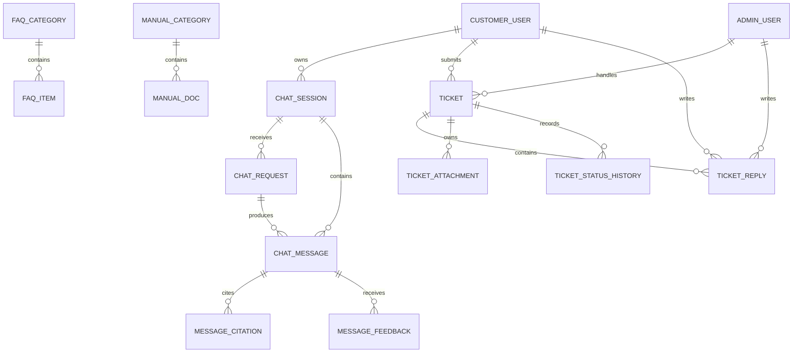

# 信创智能客服数据库表说明文档

版本：v1.0  
日期：2026-08-25  
适用数据库：MySQL 8.0+  
对应建表脚本：`01_schema.sql`

## 1. 文档用途

本文档说明当前练习项目中每张数据库表：

- 保存什么数据；
- 在业务中的作用；
- 主要字段的含义；
- 与其他表的关系；
- 对应哪些前端接口。

当前数据库是一套面向学习的核心模型，覆盖用户登录、智能问答、FAQ、维修手册和留言工单。模型供应商、Prompt 版本、向量索引等高级功能暂未建表，可以在学习到对应模块时继续扩展。

## 2. 通用字段约定

很多业务表包含以下公共字段：

| 字段 | 类型 | 含义 |
|---|---|---|
| `id` | `BIGINT UNSIGNED` | 数据库内部自增主键，只在后端内部使用 |
| `public_id` | `VARCHAR` | 返回给前端的业务 ID，不向前端暴露连续主键 |
| `version` | `INT UNSIGNED` | 乐观锁版本，更新数据时用于防止并发覆盖 |
| `created_at` | `DATETIME(3)` | 创建时间，数据库统一保存 UTC |
| `updated_at` | `DATETIME(3)` | 最后更新时间，数据库统一保存 UTC |
| `deleted_at` | `DATETIME(3)` | 软删除时间；为空表示数据仍然有效 |

后端返回时间时转换为 ISO-8601，例如：

```text
2026-08-25T07:30:00Z
```

前端再根据用户时区显示为本地时间。

## 3. 数据表总览

| 模块 | 表名 | 保存的数据 | 主要作用 |
|---|---|---|---|
| 用户认证 | `customer_user` | 普通用户账号和资料 | 用户登录及业务数据归属 |
| 用户认证 | `admin_user` | 客服、管理员账号 | 工单处理和后台管理 |
| 用户认证 | `refresh_token` | Refresh Token 摘要和轮换关系 | 维持登录状态并防止 token 重放 |
| 用户认证 | `auth_sms_code` | 预留的短信验证码摘要 | 当前登录实现不使用，后续短信审计扩展预留 |
| 用户认证 | `login_audit` | 登录成功与失败记录 | 安全审计和登录风控 |
| 智能问答 | `chat_session` | 用户会话 | 管理多轮对话和历史列表 |
| 智能问答 | `chat_request` | 一次问答请求 | 跟踪 SSE 请求状态和取消 |
| 智能问答 | `chat_message` | 用户和 AI 的消息 | 保存完整聊天内容 |
| 智能问答 | `message_citation` | AI 回答引用 | 说明答案来源 |
| 智能问答 | `message_feedback` | 用户赞踩 | 收集答案质量反馈 |
| 内容中心 | `faq_category` | FAQ 分类 | FAQ 分类和排序 |
| 内容中心 | `faq_item` | FAQ 问答内容 | 常见问题搜索与展示 |
| 内容中心 | `manual_category` | 手册分类 | 维修手册分类和排序 |
| 内容中心 | `manual_doc` | 手册信息和文件位置 | 手册搜索、下载和知识来源 |
| 工单 | `ticket` | 工单主体 | 保存用户提交的问题和处理状态 |
| 工单 | `ticket_reply` | 工单沟通内容 | 用户与客服持续沟通 |
| 工单 | `ticket_attachment` | 工单附件元数据 | 管理附件上传、绑定和下载权限 |
| 工单 | `ticket_status_history` | 工单状态变化 | 展示处理时间线并保留历史 |
| 公共能力 | `api_idempotency_record` | 写接口幂等结果 | 防止重复提交工单或重复问答 |
| 公共能力 | `operation_audit` | 关键操作审计 | 记录谁对什么资源做了什么操作 |

## 4. 主要关系



## 5. 用户和认证模块

### 5.1 `customer_user`：普通用户表

保存的数据：使用智能客服和工单系统的普通用户账号、登录信息及展示资料。

主要作用：

- 校验用户账号和密码；
- 返回登录后的用户资料；
- 作为会话、消息反馈和工单的所有者；
- 控制用户只能查询自己的数据。

| 字段 | 含义 |
|---|---|
| `id` | 内部用户主键 |
| `public_id` | 返回前端的用户 ID，例如 `user_demo` |
| `account` | 登录账号，可以是手机号或自定义账号 |
| `phone` | 手机号；当前练习环境直接保存，生产环境应加密 |
| `phone_hash` | 手机号摘要，用于手机号精确查询和去重 |
| `password_hash` | 密码哈希，正式环境应使用 BCrypt 或 Argon2 |
| `nickname` | 页面显示的用户名称 |
| `avatar_text` | 没有头像时显示的简称 |
| `status` | `ACTIVE`、`DISABLED` 或 `LOCKED` |
| `version` | 用户信息乐观锁版本 |
| `last_login_at` | 最后一次成功登录时间 |
| `created_at` | 注册时间 |
| `updated_at` | 用户信息更新时间 |
| `deleted_at` | 软删除时间 |

关联关系：一个用户可以拥有多个 `chat_session`、`chat_request`、`message_feedback` 和 `ticket`。

对应接口：`POST /auth/login`、`POST /auth/refresh`、所有需要用户身份的接口。

### 5.2 `admin_user`：客服和管理员表

保存的数据：客服人员和系统管理员的账号、角色、状态及锁定信息。

主要作用：

- 登录管理端；
- 作为工单负责人；
- 代表客服回复用户工单；
- 区分普通客服和系统管理员。

| 字段 | 含义 |
|---|---|
| `id` | 内部管理员主键 |
| `public_id` | 对外管理员 ID |
| `username` | 管理端登录账号 |
| `password_hash` | 管理员密码哈希 |
| `display_name` | 工单页面显示的客服名称，例如“王工” |
| `role_code` | `SUPPORT` 表示客服，`ADMIN` 表示管理员 |
| `status` | `ACTIVE`、`DISABLED` 或 `LOCKED` |
| `failed_count` | 连续登录失败次数 |
| `locked_until` | 账号锁定截止时间 |
| `version` | 乐观锁版本 |
| `created_at` | 创建时间 |
| `updated_at` | 更新时间 |
| `deleted_at` | 软删除时间 |

关联关系：可以被 `ticket.assignee_id` 引用，也可以作为 `ticket_reply` 的客服发送者。

### 5.3 `refresh_token`：刷新令牌表

保存的数据：Refresh Token 的安全摘要、所属用户、设备、有效期、撤销状态和轮换关系。

主要作用：

- 浏览器刷新页面后恢复登录；
- Access Token 过期后获取新的 Access Token；
- 实现 Refresh Token 轮换；
- 检测旧 token 被重复使用；
- 注销单个设备。

| 字段 | 含义 |
|---|---|
| `id` | 内部主键 |
| `token_hash` | Refresh Token 的 SHA-256 摘要，数据库不保存原 token |
| `token_family_id` | 一次登录产生的 token 轮换链 ID |
| `subject_type` | `CUSTOMER` 或 `ADMIN` |
| `subject_id` | 对应用户或管理员的内部主键 |
| `device_id` | 当前浏览器或设备标识 |
| `expires_at` | token 到期时间 |
| `revoked_at` | token 被注销或轮换的时间 |
| `replaced_by_token_hash` | 新 token 的摘要，用于追踪轮换链 |
| `created_at` | token 创建时间 |

对应接口：`POST /auth/login`、`POST /auth/refresh`、`POST /auth/logout`。

注意：该表只保存 token 摘要。真实 Refresh Token 只通过 HttpOnly Cookie 发给浏览器。

### 5.4 `auth_sms_code`：短信验证码表

保存的数据：手机号摘要、验证码摘要、用途、有效期和使用状态。

当前 Java 登录实现按练习需求改用 Redis database 3 保存 5 分钟验证码，本表暂不写入，保留给后续短信审计或验证码持久化练习。

主要作用：

- 支持手机号验证码登录；
- 限制验证码有效期；
- 防止同一验证码重复使用；
- 统计连续校验失败次数。

| 字段 | 含义 |
|---|---|
| `phone_hash` | 手机号摘要，不使用手机号明文进行索引 |
| `code_hash` | 验证码摘要，不保存验证码明文 |
| `purpose` | `LOGIN` 或 `RESET_PASSWORD` |
| `expires_at` | 验证码过期时间 |
| `used_at` | 验证码成功使用时间 |
| `failed_count` | 输入错误次数 |
| `request_id` | 发送验证码时的请求 ID |
| `created_at` | 发送时间 |

对应接口：`POST /auth/sms-codes` 和短信模式的 `POST /auth/login`。

### 5.5 `login_audit`：登录审计表

保存的数据：登录主体、登录方式、成功或失败结果、失败原因、IP、浏览器和请求 ID。

主要作用：

- 排查用户无法登录的问题；
- 检测短时间内大量失败登录；
- 记录账号锁定原因；
- 满足安全审计需要。

| 字段 | 含义 |
|---|---|
| `subject_type` | 登录主体类型，例如 `CUSTOMER` 或 `ADMIN` |
| `subject_ref` | 脱敏账号或不可逆账号摘要 |
| `login_mode` | `password`、`sms` 或 `mfa` |
| `result` | `SUCCESS` 或 `FAILED` |
| `reason_code` | 稳定失败原因，例如 `INVALID_PASSWORD` |
| `ip_address` | 请求来源 IP |
| `user_agent` | 浏览器 User-Agent |
| `request_id` | 关联接口请求日志的 ID |
| `created_at` | 登录发生时间 |

安全要求：不得在该表保存密码、短信验证码、Access Token 或 Refresh Token。

## 6. 智能问答模块

### 6.1 `chat_session`：聊天会话表

保存的数据：一个用户的一组多轮对话及其列表展示信息。

主要作用：

- 展示左侧历史会话列表；
- 将多轮用户消息和 AI 回答组织到同一个上下文；
- 支持重命名和软删除会话。

| 字段 | 含义 |
|---|---|
| `id` | 会话自增主键，也是接口中的 `sessionId` |
| `user_id` | 会话所属用户 |
| `title` | 会话标题 |
| `preview` | 会话列表中显示的最后消息摘要 |
| `status` | `ACTIVE` 或 `ARCHIVED` |
| `last_message_at` | 最后一条消息时间，用于列表倒序 |
| `version` | 乐观锁版本 |
| `created_at` | 会话创建时间 |
| `updated_at` | 会话更新时间 |
| `deleted_at` | 用户删除会话的时间 |

对应接口：`GET /sessions`、`PATCH /sessions/{id}`、`DELETE /sessions/{id}`。

首次对话时，由后端先创建该表记录，再通过 SSE `meta` 事件把自增 `id` 返回给前端。

### 6.2 `chat_request`：问答请求表

保存的数据：用户每次点击发送后产生的一次后端处理任务。

主要作用：

- 跟踪 SSE 问答是否正在运行、成功、失败或取消；
- 支持用户点击“停止生成”；
- 网络断开后查询最终处理状态；
- 保存一次生成任务的处理状态。

| 字段 | 含义 |
|---|---|
| `id` | 问答请求自增主键，也是接口中的 `requestId` |
| `session_id` | 所属聊天会话 |
| `user_id` | 发起请求的用户 |
| `request_hash` | 请求正文摘要，用于定位和比较请求内容 |
| `status` | 请求当前状态 |
| `started_at` | 开始执行时间 |
| `finished_at` | 进入终态的时间 |
| `error_code` | 失败时的稳定错误码 |
| `error_message` | 可向用户展示的失败说明 |
| `model_route` | 本次请求使用的模型路由 |
| `usage_json` | Token、模型、费用等结构化用量数据 |
| `created_at` | 请求接收时间 |
| `updated_at` | 状态更新时间 |

状态值：`ACCEPTED`、`RUNNING`、`SUCCEEDED`、`FAILED`、`CANCELLED`、`INTERRUPTED`。

对应接口：`POST /chat/stream`、`GET /chat/requests/{requestId}`、`POST /chat/requests/{requestId}/cancel`。

### 6.3 `chat_message`：聊天消息表

保存的数据：用户消息和 AI 回答正文。

主要作用：

- 展示聊天记录；
- 为下一轮问答提供多轮上下文；
- 保存 AI 最终完整回答；
- 区分完整、中断和失败消息。

| 字段 | 含义 |
|---|---|
| `id` | 消息自增主键，也是接口中的 `messageId` |
| `session_id` | 消息所属会话 |
| `request_id` | 产生该消息的问答请求；普通系统欢迎语可以为空 |
| `role` | `user` 或 `assistant` |
| `status` | `COMPLETED`、`STREAMING`、`INTERRUPTED` 或 `FAILED` |
| `content` | 消息完整正文 |
| `stage` | AI 当前/最终处理阶段 |
| `intent_type` | 识别出的业务意图，可为空 |
| `model_name` | AI 回答使用的模型名称 |
| `token_count` | 该消息的 Token 数量 |
| `created_at` | 消息创建时间 |
| `updated_at` | 流式内容或状态更新时间 |

对应接口：`GET /sessions/{id}/messages` 和 `POST /chat/stream`。

只有 `COMPLETED` 的 AI 消息才能作为正式答案进入后续上下文；中断文本只能用于页面提示。

### 6.4 `message_citation`：消息引用表

保存的数据：AI 回答当时引用的手册或知识文档快照。

主要作用：

- 在回答下方展示知识来源；
- 让用户知道答案来自哪份手册和哪一页；
- 即使手册后来更新，也能解释历史回答依据。

| 字段 | 含义 |
|---|---|
| `message_id` | 被引用信息所属的 AI 消息 |
| `ordinal_no` | 引用在当前回答中的顺序 |
| `source_id` | 引用来源的内部主键，暂无明确来源记录时可为空 |
| `title` | 回答生成时的文档标题快照 |
| `snippet` | 被引用的正文片段快照 |
| `source_locator` | 应用内稳定资源地址，不保存临时签名 URL |
| `page_no` | PDF 页码，可为空 |
| `score` | 检索相关度分数，可为空 |
| `created_at` | 引用创建时间 |

关联关系：删除 `chat_message` 时，其引用记录级联删除。

### 6.5 `message_feedback`：回答反馈表

保存的数据：用户对某条 AI 回答的赞、踩和可选意见。

主要作用：

- 支持前端“赞”和“踩”；
- 统计回答满意度；
- 为后续知识和模型效果分析提供数据。

| 字段 | 含义 |
|---|---|
| `message_id` | 被评价的 AI 消息 |
| `user_id` | 提交评价的用户 |
| `feedback` | `up`、`down` 或 `NULL`；NULL 表示清除 |
| `comment` | 可选文字说明 |
| `created_at` | 第一次提交时间 |
| `updated_at` | 最近一次修改时间 |

同一用户对同一消息只有一条记录，通过更新实现覆盖反馈。

对应接口：`PUT /messages/{messageId}/feedback`。

## 7. FAQ 和维修手册模块

### 7.1 `faq_category`：FAQ 分类表

保存的数据：FAQ 的分类名称、顺序和启用状态。

主要作用：

- 将 FAQ 分为驱动问题、网络问题、保修咨询等类别；
- 控制分类展示顺序；
- 停用分类而不立即删除历史数据。

| 字段 | 含义 |
|---|---|
| `public_id` | 返回前端的分类 ID |
| `name` | 分类名称 |
| `sort_order` | 数字越小越靠前 |
| `status` | `ENABLED` 或 `DISABLED` |
| `version` | 乐观锁版本 |
| `created_at` | 创建时间 |
| `updated_at` | 更新时间 |

对应接口：`GET /faq/categories`。

### 7.2 `faq_item`：FAQ 内容表

保存的数据：FAQ 的标题、问题、答案、摘要、关键词和发布状态。

主要作用：

- 展示热门 FAQ；
- 按关键词或分类搜索问题；
- 为 AI 问答提供简单知识来源；
- 管理 FAQ 草稿、发布和归档状态。

| 字段 | 含义 |
|---|---|
| `public_id` | FAQ 对外 ID |
| `category_id` | 所属 FAQ 分类 |
| `title` | 列表标题 |
| `question` | 用户常见问题 |
| `answer` | 标准答案正文 |
| `summary` | 列表中的简短说明 |
| `keywords` | 辅助搜索关键词 |
| `status` | `DRAFT`、`PUBLISHED` 或 `ARCHIVED` |
| `is_top` | 是否置顶 |
| `hot_count` | 热度/浏览次数 |
| `published_at` | 发布时间 |
| `version` | 乐观锁版本 |
| `created_at` | 创建时间 |
| `updated_at` | 更新时间 |
| `deleted_at` | 软删除时间 |

只有 `PUBLISHED` 且未删除的 FAQ 才能返回给普通用户。

对应接口：`GET /faq`。

### 7.3 `manual_category`：手册分类表

保存的数据：维修手册分类、展示顺序和启用状态。

主要作用：将手册分为驱动手册、网络手册和服务手册等类别。

| 字段 | 含义 |
|---|---|
| `public_id` | 分类对外 ID |
| `name` | 分类名称 |
| `sort_order` | 展示顺序 |
| `status` | `ENABLED` 或 `DISABLED` |
| `version` | 乐观锁版本 |
| `created_at` | 创建时间 |
| `updated_at` | 更新时间 |

### 7.4 `manual_doc`：维修手册表

保存的数据：手册标题、摘要、解析文本、文件位置、文件元数据、扫描状态和发布状态。

主要作用：

- 展示和搜索维修手册；
- 生成手册下载地址；
- 为 AI 检索提供解析后的文本；
- 记录文件是否通过安全扫描。

| 字段 | 含义 |
|---|---|
| `public_id` | 手册对外 ID |
| `category_id` | 所属手册分类 |
| `title` | 手册标题 |
| `summary` | 手册摘要 |
| `parsed_text` | 从 PDF/DOCX 中解析的正文，可为空 |
| `object_key` | 本地存储或 MinIO 中的对象键 |
| `file_name` | 原始文件名 |
| `content_type` | MIME 类型，例如 `application/pdf` |
| `file_size` | 文件字节数 |
| `sha256` | 文件 SHA-256 摘要 |
| `scan_status` | `PENDING`、`PASSED` 或 `REJECTED` |
| `status` | `DRAFT`、`PUBLISHED` 或 `ARCHIVED` |
| `version_no` | 当前手册内容版本号 |
| `published_at` | 发布时间 |
| `version` | 乐观锁版本 |
| `created_at` | 创建时间 |
| `updated_at` | 更新时间 |
| `deleted_at` | 软删除时间 |

普通用户只能搜索 `scan_status=PASSED`、`status=PUBLISHED` 且未删除的手册。

对应接口：`GET /manuals`、`GET /manuals/{manualId}/download-url`。

## 8. 工单模块

### 8.1 `ticket`：工单主体表

保存的数据：用户提交的问题、设备信息、联系方式、处理状态、负责人和解决结论。

主要作用：

- 展示工单列表和详情；
- 支持客服受理和分配；
- 管理工单状态；
- 保存最终解决说明。

| 字段 | 含义 |
|---|---|
| `public_id` | 工单编号，例如 `WO202608240018` |
| `user_id` | 工单所属普通用户 |
| `title` | 问题标题 |
| `category` | 问题分类，例如“驱动问题” |
| `device_brand` | 设备品牌 |
| `device_model` | 设备型号 |
| `description` | 用户提交的问题描述 |
| `contact` | 联系方式；练习环境明文，生产应加密 |
| `status` | 当前工单状态 |
| `assignee_id` | 当前负责客服，可以为空 |
| `resolution` | 最终解决说明 |
| `resolved_at` | 解决时间 |
| `closed_at` | 关闭时间 |
| `version` | 乐观锁版本 |
| `created_at` | 提交时间 |
| `updated_at` | 最后更新时间 |
| `deleted_at` | 软删除时间 |

状态值：`PENDING`、`PROCESSING`、`WAITING_USER`、`RESOLVED`、`CLOSED`。

对应接口：`POST /tickets`、`GET /tickets`、`GET /tickets/{id}`、关闭和重开接口。

### 8.2 `ticket_reply`：工单回复表

保存的数据：用户补充信息和客服回复。

主要作用：

- 在工单详情中展示沟通记录；
- 支持用户补充设备信息和错误提示；
- 支持客服提供排查方法和处理结论。

| 字段 | 含义 |
|---|---|
| `public_id` | 回复对外 ID |
| `ticket_id` | 所属工单 |
| `sender_type` | `user` 或 `admin` |
| `customer_user_id` | 用户回复时填写，客服回复时为空 |
| `admin_user_id` | 客服回复时填写，用户回复时为空 |
| `sender_name_snapshot` | 发送时的名称快照，避免用户改名影响历史 |
| `content` | 回复正文 |
| `created_at` | 回复时间 |

数据库检查约束保证一条回复只能有一种发送者。

对应接口：`POST /tickets/{ticketId}/replies`。

### 8.3 `ticket_attachment`：工单附件表

保存的数据：附件文件名、大小、类型、对象位置、安全扫描状态和所属工单。

主要作用：

- 管理用户上传的截图、日志、PDF 等文件；
- 在创建工单前保存临时附件；
- 创建工单时把附件绑定到工单；
- 下载前根据工单所有权重新鉴权；
- 定期清理没有绑定工单的临时文件。

| 字段 | 含义 |
|---|---|
| `public_id` | 返回前端的附件 ID |
| `uploader_user_id` | 上传附件的用户 |
| `ticket_id` | 绑定的工单；临时附件时为空 |
| `reply_id` | 如果附件属于某次回复，则指向回复 |
| `object_key` | 本地文件或 MinIO 对象位置 |
| `file_name` | 原始文件名 |
| `content_type` | MIME 类型 |
| `file_size` | 文件字节数 |
| `sha256` | 文件内容摘要 |
| `scan_status` | `PENDING`、`PASSED` 或 `REJECTED` |
| `bind_status` | `TEMP`、`BOUND` 或 `REJECTED` |
| `expires_at` | 临时附件自动清理时间 |
| `created_at` | 上传时间 |

对应接口：`POST /ticket-attachments` 和附件下载授权接口。

注意：数据库只保存附件元数据和对象键，不应把大文件二进制直接存进 MySQL。

### 8.4 `ticket_status_history`：工单状态历史表

保存的数据：每次工单状态变化前后的状态、操作者、原因和时间。

主要作用：

- 在工单详情中展示处理时间线；
- 记录客服何时受理、何时要求补充、何时解决；
- 保留关闭和重新打开的原因；
- 审计非法或异常状态迁移。

| 字段 | 含义 |
|---|---|
| `public_id` | 时间线记录对外 ID |
| `ticket_id` | 所属工单 |
| `from_status` | 变更前状态；创建工单时可以为空 |
| `to_status` | 变更后状态 |
| `operator_type` | `SYSTEM`、`CUSTOMER` 或 `ADMIN` |
| `operator_id` | 操作者内部 ID；系统操作时可以为空 |
| `title` | 前端时间线标题，例如“客服已受理” |
| `reason` | 状态变化原因或说明 |
| `request_id` | 触发状态变化的接口请求 ID |
| `created_at` | 状态变化时间 |

创建、关闭、重开、解决等操作应在同一数据库事务中同时更新 `ticket` 并插入一条状态历史。

## 9. 公共支撑表

### 9.1 `api_idempotency_record`：接口幂等表

保存的数据：幂等键、调用方、请求摘要、已经创建的资源和原始响应。

主要作用：

- 防止用户连续点击造成重复工单；
- 防止网络重试造成重复回复；
- 防止相同问答被重复提交；
- 对同一个幂等键返回之前的处理结果。

| 字段 | 含义 |
|---|---|
| `scope_name` | 接口作用域，例如 `POST:/api/v1/tickets` |
| `caller_id` | 当前调用用户 ID |
| `idempotency_key` | 前端传入的幂等键 |
| `request_hash` | 请求正文摘要 |
| `resource_type` | 已创建资源类型，例如 `TICKET` |
| `resource_id` | 已创建资源的对外 ID |
| `response_status` | 首次处理时返回的 HTTP 状态码 |
| `response_body` | 可选的原响应 JSON |
| `expires_at` | 幂等记录过期时间 |
| `created_at` | 首次处理时间 |

唯一约束为 `scope_name + caller_id + idempotency_key`。

处理规则：

1. 没有记录：创建占位并执行业务。
2. 已有记录且请求摘要相同：返回原结果。
3. 已有记录但请求摘要不同：返回 `409 IDEMPOTENCY_KEY_CONFLICT`。

### 9.2 `operation_audit`：操作审计表

保存的数据：操作者、操作名称、资源、执行结果、来源 IP 和必要的非敏感说明。

主要作用：

- 记录工单关闭、重开、分派等关键操作；
- 排查数据为何被修改；
- 通过 `request_id` 关联接口日志；
- 为后台审计页面提供查询数据。

| 字段 | 含义 |
|---|---|
| `request_id` | 关联接口日志的请求 ID |
| `actor_type` | `CUSTOMER`、`ADMIN` 或 `SYSTEM` |
| `actor_id` | 操作者对外 ID |
| `action_name` | 操作名称，例如 `TICKET_REOPEN` |
| `resource_type` | 被操作资源类型 |
| `resource_id` | 被操作资源对外 ID |
| `result` | `SUCCESS` 或 `FAILED` |
| `detail_json` | 非敏感操作说明 |
| `ip_address` | 请求来源 IP |
| `user_agent` | 浏览器或调用方标识 |
| `created_at` | 操作发生时间 |

安全要求：`detail_json` 不得保存密码、验证码、Cookie、Bearer Token、完整联系方式、模型密钥或附件正文。

## 10. 典型业务数据流

### 10.1 用户登录

1. 根据 `customer_user.account` 或 `phone_hash` 查询用户。
2. 校验 `password_hash` 和 `status`。
3. 在 `refresh_token` 创建 token 摘要。
4. 在 `login_audit` 写入登录结果。
5. 返回 Access Token、Refresh Cookie 和用户资料。

### 10.2 发起一次新对话

1. 首次对话先创建 `chat_session`。
2. 在 `chat_request` 创建 `ACCEPTED` 记录。
3. 在 `chat_message` 写入用户消息和空的 AI 消息。
4. 请求执行时把 `chat_request` 改为 `RUNNING`。
5. SSE 生成结束后更新 AI 消息正文和状态。
6. 保存 `message_citation`。
7. 把 `chat_request` 更新为 `SUCCEEDED`。
8. 更新 `chat_session.preview` 和 `last_message_at`。

第 5～8 步应尽量在一个事务中完成，避免请求成功但消息没有保存。

### 10.3 创建带附件的工单

1. 上传文件后创建 `ticket_attachment`，状态为 `TEMP`。
2. 文件扫描通过后，将 `scan_status` 改为 `PASSED`。
3. 创建 `ticket`，初始状态为 `PENDING`。
4. 校验附件上传者后，把附件绑定到工单并改为 `BOUND`。
5. 在 `ticket_status_history` 插入“工单已提交”。
6. 在 `api_idempotency_record` 保存创建结果。

步骤 3～6 应在同一事务中完成。

## 11. 数据安全说明

当前 SQL 以本机练习为目标，以下字段为了学习方便使用了简化设计：

- `customer_user.phone` 保存手机号明文；
- `ticket.contact` 保存联系方式明文；
- 开发种子密码使用 `{noop}123456`；
- 手册 `object_key` 使用占位路径。

如果以后部署到公网或保存真实用户数据，应至少完成：

- 手机号和工单联系方式应用层加密；
- 密码全部改用 BCrypt 或 Argon2；
- Refresh Token 只保存摘要；
- 附件存入受控目录或 MinIO，下载前重新鉴权；
- 日志和审计数据脱敏；
- 数据库账号按最小权限配置。

## 12. 推荐实体类命名

| 数据表 | Java 实体类建议 |
|---|---|
| `customer_user` | `CustomerUser` |
| `admin_user` | `AdminUser` |
| `refresh_token` | `RefreshToken` |
| `auth_sms_code` | `AuthSmsCode` |
| `login_audit` | `LoginAudit` |
| `chat_session` | `ChatSession` |
| `chat_request` | `ChatRequest` |
| `chat_message` | `ChatMessage` |
| `message_citation` | `MessageCitation` |
| `message_feedback` | `MessageFeedback` |
| `faq_category` | `FaqCategory` |
| `faq_item` | `FaqItem` |
| `manual_category` | `ManualCategory` |
| `manual_doc` | `ManualDocument` |
| `ticket` | `Ticket` |
| `ticket_reply` | `TicketReply` |
| `ticket_attachment` | `TicketAttachment` |
| `ticket_status_history` | `TicketStatusHistory` |
| `api_idempotency_record` | `ApiIdempotencyRecord` |
| `operation_audit` | `OperationAudit` |

建议后端 DTO 使用接口文档中的 camelCase 字段，数据库和实体映射继续使用 snake_case，不要让前端直接依赖数据库字段名。
