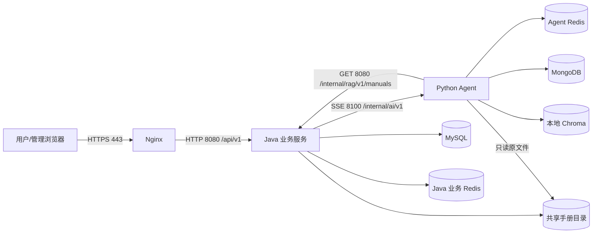
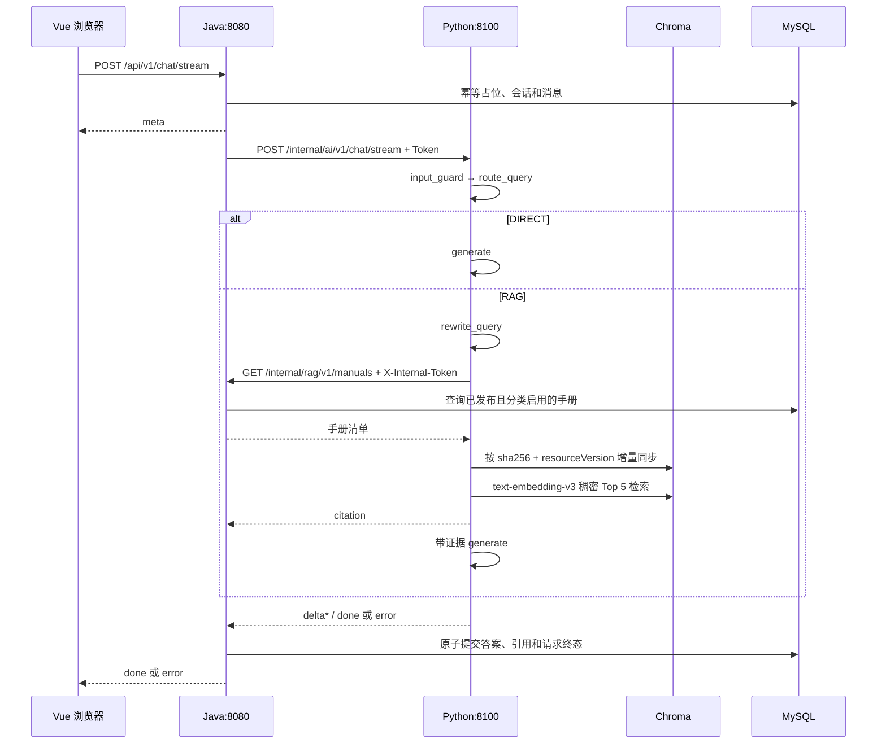

# 信创智能客服各端端口与调用流程

版本：v1.1（2026-08-30）

## 1. 端口与数据职责

| 区域 | 组件 | 默认端口/位置 | 是否公网开放 | 主要职责 |
|---|---|---:|---|---|
| 接入区 | Nginx HTTPS | 443 | 是 | Vue 静态资源与 `/api/v1/**` 反向代理 |
| 应用区 | Java 业务 API | 8080 | 否 | 用户、管理、MySQL、FAQ 缓存与 Agent 网关 |
| AI 区 | Python Agent | 8100 | 否 | LangGraph、模型调用、RAG 和 SSE |
| 数据区 | MySQL | 3306 | 否 | FAQ、手册清单、聊天与工单业务真相源 |
| 数据区 | Java 业务 Redis | 按 `REDIS_*` 配置 | 否 | 登录、验证码、FAQ cache-aside |
| 数据区 | Agent Redis | 按 `AGENT_REDIS_URL` 配置 | 否 | LangGraph checkpoint、会话锁、归档 Stream |
| 数据区 | MongoDB | 27017 | 否 | Agent 已完成对话轮次永久归档 |
| Agent 数据目录 | Chroma | 本地目录 | 否 | 可由手册清单和原文件重建的 1024 维稠密索引 |
| 共享数据目录 | 维修手册文件 | 绝对路径/共享卷 | 否 | Java 写入，Python 只读解析 |

Java Redis 与 Agent Redis 是两个独立服务、连接和数据空间，禁止合并。Chroma 不保存业务
真相，也不使用 Redis 保存手册索引状态。

## 2. URL 路由

| 外部路径 | Nginx 动作 | 后端路径 |
|---|---|---|
| `/`、`/login`、`/chat`、`/tickets/**` | `try_files` 回退 `/index.html` | 无 |
| `/assets/**` | 静态文件长期缓存 | 无 |
| `/api/v1/chat/stream` | 关闭缓冲和缓存，长超时 | Java 8080 原路径 |
| `/api/v1/**` | 普通反向代理 | Java 8080 原路径 |
| `/internal/**` | 公网直接 `404` | 不代理 |

浏览器只访问 Nginx。Java 调用 Python `/internal/ai/v1`；Python 通过内网读取 Java
`/internal/rag/v1/manuals`。双方不得通过公网域名绕回 Nginx。

## 3. 调用方向

## 4. 流式问答与 RAG

路由输出无法解析时默认走 RAG。只有 RAG 分支执行查询重写和索引同步。清单、解析、Embedding
或 Chroma 不可用时，本轮不查询可能过期的索引，生成节点会明确说明未能核对手册。

当前需求不需要工具调用；检索是确定性 LangGraph 节点，Java 传入的 `toolsEnabled` 保持
`false`。

## 5. 手册发布与索引一致性

管理端上传 PDF、DOCX、TXT、MD 后，Java 把原文件写入 `MANUAL_STORAGE_DIRECTORY`，并将
`objectKey`、SHA-256、版本号和发布状态保存到 MySQL。旧版二进制 DOC 不再接收。

Python 的 `AGENT_MANUAL_STORAGE_DIRECTORY` 必须指向同一物理目录。每次 RAG 查询同步时：

- 未变化手册保留现有切片，不重复调用 Embedding；
- 新增或版本变化手册先删除旧切片，再解析和写入新切片；
- 归档、分类禁用或删除的手册从 Chroma 删除；
- 切片 ID 为 `documentId:resourceVersion:chunkIndex`；
- Chroma 仅位于 Agent 的 `AGENT_CHROMA_DIRECTORY`，无需 Java 双写或额外索引任务表。

Java 和 Python 可部署在同一主机，也可挂载同一共享卷。生产环境两边都应配置明确的绝对
路径，并在启动前验证当前进程分别具备写入和只读权限。

## 6. FAQ 查询与缓存

用户 FAQ 分类、列表和详情只访问 Java。详情流程为：先读 Java Redis
`detail:{faqId}`；未命中时查询已发布且分类启用的 MySQL 数据；命中后按既有 TTL 回填。

管理端创建、编辑、发布、归档 FAQ，修改分类、排序或由工单转 FAQ 后，在业务事务成功
提交后统一删除 FAQ 分类、列表和详情缓存。下一次用户请求负责回填，避免数据库与缓存双写。

## 7. 网络与部署检查表

- Nginx 不代理 `/internal/**`，Java、Python、数据库和数据目录均不直接暴露公网。
- Java 与 Python 配置相同的随机长 `AGENT_INTERNAL_TOKEN`；开发环境 Java Token 为空时
  仅用于本机联调。
- `MANUAL_STORAGE_DIRECTORY` 与 `AGENT_MANUAL_STORAGE_DIRECTORY` 指向同一物理目录。
- `AGENT_CHROMA_DIRECTORY` 使用 Agent 独立的可持久化数据目录。
- Java `REDIS_*` 与 Python `AGENT_REDIS_URL` 分开配置、分开监控、分开备份策略。
- SSE 路径关闭代理缓冲；普通 API 保持默认缓冲。
- 前端、API 和 Cookie 使用同一 HTTPS 域名，避免宽松 CORS。
