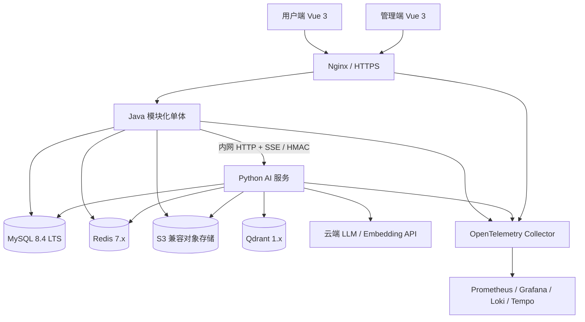
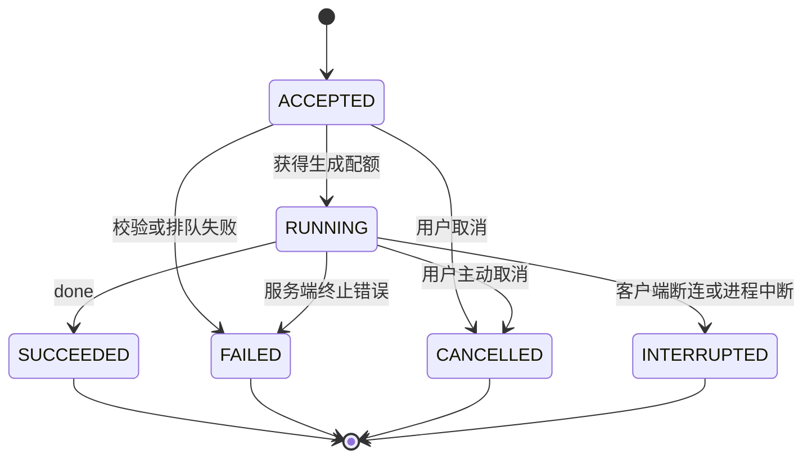
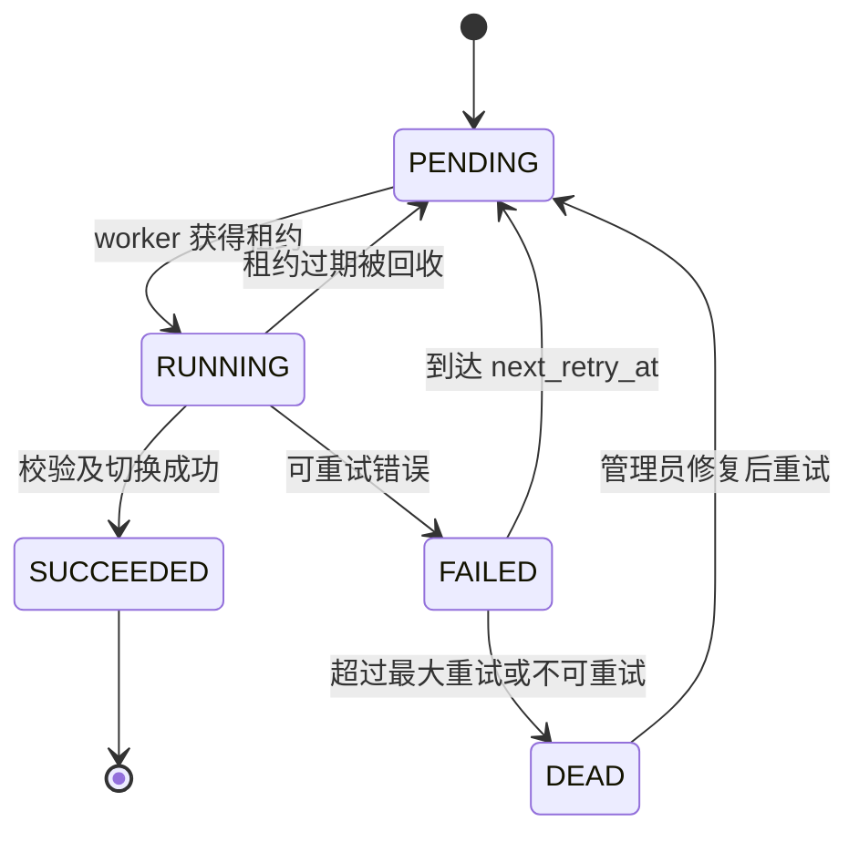
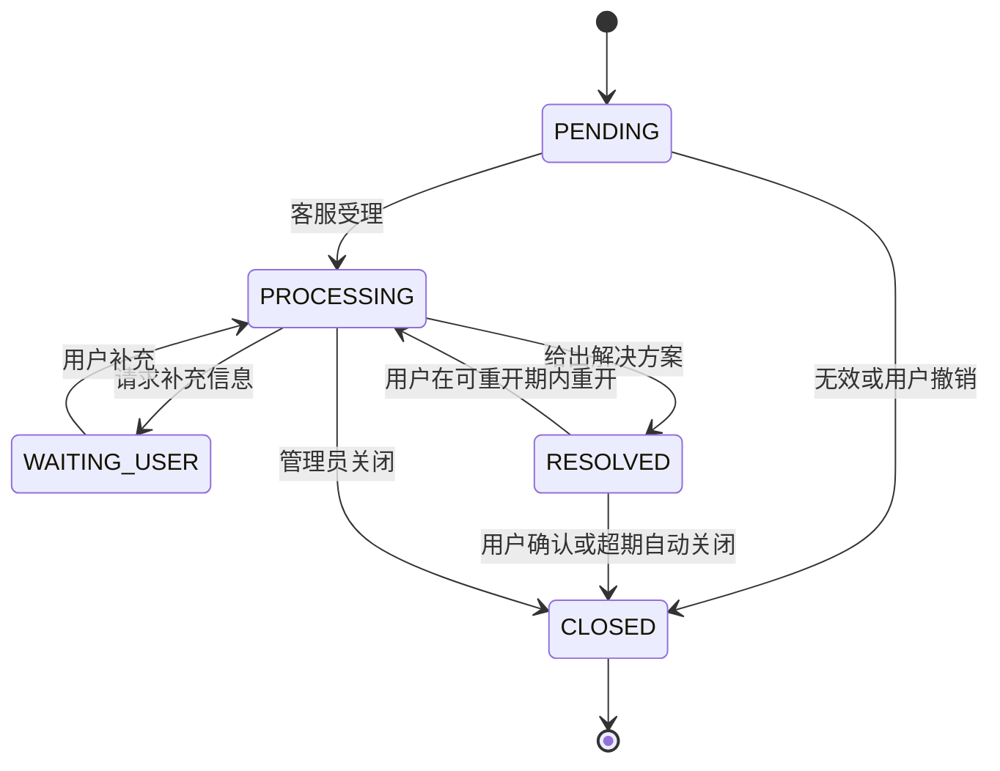
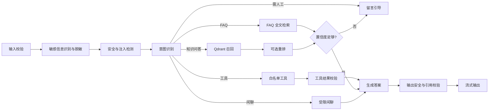
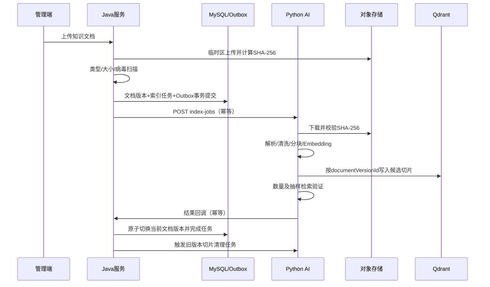
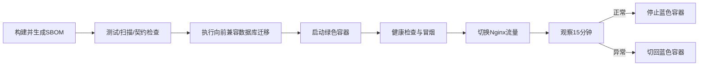

# 智能客服系统架构设计文档

> 文档版本：v2.0  
> 文档状态：架构评审与开发基线  
> 更新日期：2026-08-24  
> 适用范围：信创产品售后服务智能客服系统  
> 部署形态：传统 Linux 服务器 / Docker Compose / 阿里云 ECS  
> 保密级别：内部

---

## 0. 文档控制

### 0.1 修订记录

| 版本 | 日期 | 状态 | 主要变更 |
|---|---|---|---|
| v1.0 | 2025-01 | 初稿 | 建立用户端、管理端、Java 业务服务和 Python AI 服务的基础方案 |
| v1.1 | 2025-01 | 评审稿 | Agent 改用 LangChain，向量库改用 Chroma，全文检索使用 Meilisearch |
| v2.0 | 2026-08-24 | 开发基线 | 按企业级要求重构；明确容量、SLO、接口契约、状态机、数据治理、安全、可靠任务、可观测、部署灾备与验收基线；AI 编排改为 LangGraph；检索改为 MySQL ngram + Qdrant |

### 0.2 文档用途

本文档用于：

- 架构评审及安全评审。
- 前端、Java、Python、测试和运维团队并行开发的共同基线。
- OpenAPI、JSON Schema、数据库迁移和部署设计的上位约束。
- 项目验收时确认范围、容量、可靠性和安全要求。

本文档不替代 UI 原型、详细接口文档、数据库 DDL、测试用例或运维操作手册。上述产物必须遵循本文档，发生冲突时通过架构决策记录（ADR）变更本文档后再实施。

### 0.3 关键词约定

文中“必须”表示开发与验收的强制要求；“建议”表示默认方案；“可选”表示不影响首期验收的扩展能力。

### 0.4 目录

1. [业务上下文与范围](#1-业务上下文与范围)
2. [需求、容量与服务目标](#2-需求容量与服务目标)
3. [总体架构](#3-总体架构)
4. [技术选型](#4-技术选型)
5. [领域模块与状态机](#5-领域模块与状态机)
6. [接口与事件协议](#6-接口与事件协议)
7. [数据模型与治理](#7-数据模型与治理)
8. [AI、RAG 与知识索引](#8-airag-与知识索引)
9. [安全设计](#9-安全设计)
10. [可靠性与故障处理](#10-可靠性与故障处理)
11. [可观测性与运营指标](#11-可观测性与运营指标)
12. [部署、发布与灾备](#12-部署发布与灾备)
13. [测试与验收](#13-测试与验收)
14. [架构决策与演进](#14-架构决策与演进)
15. [附录](#15-附录)

---

## 1. 业务上下文与范围

### 1.1 建设背景

系统面向国产电脑、国产操作系统及配套软件的售后服务场景，为终端用户提供故障排查、驱动安装、软件兼容、维修手册、保修政策等问答能力。无法可靠回答的问题转为留言工单，由管理员异步处理并沉淀为 FAQ 或知识文档。

本系统是“服务信创产品的客服系统”，并不要求首期运行平台完成国产化适配认证。系统采用传统企业项目部署方式，可运行在普通 Linux 服务器、虚拟机或阿里云 ECS 上。

### 1.2 建设目标

- 提供可追溯、有引用、可降级的流式智能问答。
- 通过 FAQ、维修手册和 RAG 知识库降低重复咨询量。
- 建立留言工单闭环，但不建设实时人工坐席。
- 统一管理知识、Prompt、模型、工具、成本和运营指标。
- 在中小规模下控制组件数量，确保可部署、可监控、可备份、可恢复。
- 通过清晰的接口和数据边界，使 AI 框架、模型供应商和对象存储可替换。

### 1.3 角色

| 角色 | 主要能力 |
|---|---|
| 游客 | 浏览公开 FAQ、维修手册；受限体验问答（是否开放由配置决定） |
| 注册用户 | 智能问答、历史会话、反馈、留言工单、附件上传、进度查询 |
| 内容运营 | FAQ、手册、知识库文档、Prompt 的维护与发布 |
| 工单客服 | 查看和处理留言工单、回复用户、沉淀 FAQ |
| 系统管理员 | 用户、角色、权限、模型、工具、系统配置与审计管理 |
| 审计人员 | 只读查看安全审计、AI 调用记录和变更记录 |
| 运维人员 | 部署、监控、告警、备份、恢复和发布，不直接读取业务敏感正文 |

### 1.4 系统边界

| 范围内 | 范围外 |
|---|---|
| 中文 Web 用户端和管理端 | 实时人工坐席、技能组排队、会话接管 |
| 智能问答、FAQ、手册、知识库 RAG | 大模型训练和微调平台 |
| 留言工单异步闭环 | SaaS 多租户及租户计费 |
| 云端 LLM/Embedding API 接入 | 首期本地 GPU 推理集群 |
| Token 与估算成本统计 | 财务结算系统 |
| 短信、邮件、病毒扫描的适配接口 | 自建短信、邮件或恶意代码检测引擎 |
| 普通服务器及阿里云部署映射 | Kubernetes、服务网格、跨地域双活 |

### 1.5 外部系统

| 外部系统 | 调用方向 | 数据 | 失败策略 |
|---|---|---|---|
| 云端 LLM/Embedding | AI 服务 → 供应商 | 脱敏后的问题、上下文或知识切片 | 超时、限流、熔断、切换备用模型或降级 |
| S3 兼容对象存储 | Java/Python → MinIO/OSS | 手册、知识文档、工单附件 | 重试幂等上传；失败不提交业务事务 |
| 短信/邮件服务（可选） | Java → 通知服务 | 验证码、工单通知 | 异步重试，最终失败不影响工单数据 |
| 恶意文件扫描服务 | Java → 扫描服务 | 上传文件或对象地址 | 生产环境能力必须启用；引擎可采用自建或云服务，未通过扫描的文件不得发布或被 AI 解析 |

---

## 2. 需求、容量与服务目标

### 2.1 功能需求

#### 2.1.1 用户端

| 编号 | 功能 | 验收要点 |
|---|---|---|
| U-01 | 智能问答 | POST SSE 流式输出、多轮上下文、答案引用、状态提示、取消生成、失败降级 |
| U-02 | 历史会话 | 分页、续聊、重命名、软删除、清空；只允许访问本人数据 |
| U-03 | 答案反馈 | 点赞、点踩、原因和补充说明；同一用户对同一消息仅保留一条有效反馈 |
| U-04 | FAQ | 分类、关键词搜索、热门、置顶、详情和快捷提问 |
| U-05 | 维修手册 | 分类、全文检索、版本、PDF 预览、授权下载 |
| U-06 | 留言工单 | 提交、附件、进度、补充信息、查看回复和关闭 |

#### 2.1.2 管理端

| 编号 | 功能 | 验收要点 |
|---|---|---|
| A-01 | 工单处理 | 筛选、分派、合法状态流转、回复、附件、完整审计、转 FAQ |
| A-02 | FAQ 管理 | 草稿、审核、发布、下架、排序、版本记录和全文索引 |
| A-03 | 手册管理 | 上传、扫描、解析、版本、发布、下架和下载授权 |
| A-04 | 知识库管理 | 文档版本、索引任务、进度、重试、停用、试问和命中明细 |
| A-05 | Prompt 管理 | 草稿、审核、发布、回滚；绑定场景和版本 |
| A-06 | 模型管理 | 供应商、模型、参数、路由、配额、连通性测试和密钥轮换 |
| A-07 | 工具管理 | 白名单、参数 Schema、权限、超时、结果大小和启停 |
| A-08 | 权限审计 | 管理员、角色、权限、MFA、登录记录和关键操作审计 |
| A-09 | 数据统计 | 会话、意图、命中、转工单、满意度、Token、估算成本和趋势 |

### 2.2 基准容量

以下为首期容量设计和压测基线，不表示所有请求都会同时达到峰值：

| 指标 | 基线 | 设计说明 |
|---|---:|---|
| 注册用户 | 10,000 | 单租户 |
| 日活用户 | 2,000 | 用于存储和调用量估算 |
| 并发在线会话 | 100 | 包括浏览、查询和 SSE 连接 |
| 并发模型生成 | 20 | 超出后排队或返回繁忙提示，不无限占用线程与供应商配额 |
| 普通 REST 峰值 | 100 RPS | 不含静态资源和流式 token |
| FAQ 数量 | 20,000 | MySQL ngram FULLTEXT |
| 手册数量 | 5,000 | 正文按版本保存并建立 FULLTEXT |
| 有效知识切片 | 100,000 | Qdrant 单节点基线 |
| 单文件上限 | 50 MiB | PDF、DOCX、MD、TXT；可配置但必须受反向代理与应用双重限制 |
| 单次对话输入 | 8,000 字符 | 超限拒绝，不静默截断用户原始问题 |
| 会话上下文 | 由模型上下文预算控制 | 默认最近 20 条，并由 token 预算二次裁剪 |

### 2.3 SLO 与恢复目标

| 维度 | 目标 | 统计口径 |
|---|---|---|
| 月可用性 | ≥99.5% | 不含已公告的计划维护；外部模型故障单独统计，但降级能力纳入验收 |
| 普通 API 延迟 | P95≤500ms | 100 RPS，健康依赖下，不含文件上传下载 |
| FAQ 搜索 | P95≤500ms | 2 万 FAQ 基线 |
| 向量检索 | P95≤800ms | 10 万切片、TopK=20、健康 Qdrant 下 |
| 问答首字延迟 | P95≤3s | 20 路并发、指定验收模型健康且未限流 |
| 流式错误率 | <1% | 排除用户主动取消和客户端断网 |
| RPO | ≤1 小时 | MySQL 与对象原文；缓存和派生索引不计入 RPO |
| RTO | ≤4 小时 | 恢复核心登录、FAQ、问答和工单能力 |

### 2.4 数据留存默认值

| 数据 | 默认保留 | 到期动作 |
|---|---:|---|
| 会话、消息、反馈 | 180 天 | 先软删除，清理任务到期物理删除并清理引用 |
| 普通工单与回复 | 180 天 | 已关闭且无保留标记时清理 |
| 安全与管理审计 | 365 天 | 归档后删除；具体期限可由企业制度覆盖 |
| Token/成本明细 | 365 天 | 日聚合长期保留，明细到期清理 |
| 登录验证码和防重放 Nonce | 5 分钟 | Redis TTL 自动清理 |
| 已替换知识索引 | 7 天 | 别名切换稳定后删除旧 Collection |

留存期限必须配置化。涉及投诉、诉讼或审计保全的数据设置 `legal_hold` 后不得自动删除。

---

## 3. 总体架构

### 3.1 架构风格

系统采用“两个应用部署单元 + 共享基础设施”：

- **Java 模块化单体**：承载确定性业务规则和唯一业务写入口。
- **Python AI 服务**：承载受控 AI 工作流、检索、模型与索引处理。
- 两个服务通过带 HMAC 签名的内网 HTTP/SSE 通信，不共享应用代码，不直接写对方负责的业务表。
- MySQL 和对象存储是业务与知识原文真相源；Redis、Qdrant 和统计聚合均可重建。

### 3.2 逻辑架构



### 3.3 部署单元边界

| 单元 | 负责 | 不负责 |
|---|---|---|
| Web 前端 | 展示、交互、客户端校验、流读取、trace 上下文传递 | 权限判定、业务状态机、敏感配置 |
| Java 业务服务 | IAM、会话、消息、工单、内容、配置、审计、用量、可靠任务、AI 网关 | Prompt 执行、向量检索、模型 SDK、模型工具循环 |
| Python AI 服务 | LangGraph 工作流、RAG、模型网关、工具执行、索引、AI 安全 | 用户/工单 CRUD、最终权限判断、业务真相数据修改 |
| MySQL | 业务数据、配置、原文元数据、任务和审计 | 大文件二进制、向量近邻检索 |
| Redis | 缓存、限流、短期锁、Nonce、并发计数 | 唯一业务状态、永久会话历史 |
| Qdrant | 向量及切片查询副本 | 文档原件和发布状态真相 |
| 对象存储 | 文档和附件原件 | 权限规则、业务状态 |

### 3.4 Java 模块化单体

Java 工程按领域分包并通过应用服务交互，禁止控制器跨模块直接访问 Mapper：

```text
iam / chat / content / knowledge / ticket / ai-gateway
model-config / stats / audit / task / storage / notification / shared
```

模块间保持单向依赖；`shared` 只存放稳定的基础类型和横切能力，不成为业务逻辑集合。首期不按模块拆库或拆服务。

### 3.5 Python AI 服务

```text
api / graph / guard / intent / retrieval / generation
model_gateway / embedding / tools / indexing / evaluation / observability
```

每个图节点职责单一、输入输出可序列化、外部副作用幂等。通用模型接口由 `model_gateway` 统一封装，业务图不得直接依赖某家供应商 SDK。

### 3.6 关键架构约束

1. 所有业务写操作必须经过 Java 服务。
2. Python 读取业务数据必须使用只读数据库账号或 Java 内部查询接口；不得更新工单、用户、消息等业务表。
3. Qdrant 中的数据必须能由 MySQL 元数据和对象原文重建。
4. Redis 数据丢失不得造成业务数据丢失；允许短期缓存失效、用户重新登录或限流状态重置。
5. 不在数据库、日志、SSE 或接口响应中保存/返回模型供应商密钥明文。
6. 任何外部调用必须设置连接超时、响应超时、并发上限和可观测指标。

---

## 4. 技术选型

### 4.1 Java 业务服务

| 关注点 | 选型 | 基线 |
|---|---|---|
| 语言 | Java | JDK 21 LTS |
| 框架 | Spring Boot | 3.5.x，使用受支持的最新补丁版本 |
| Web | Spring MVC + `SseEmitter`、WebClient | 普通接口 MVC；WebClient 连接 Python 流；SSE 写入使用受控执行器 |
| ORM | MyBatis | 3.x Starter；XML/注解均可，但 SQL 必须可审查 |
| 数据迁移 | Flyway | 只允许版本化、可重复验证的迁移脚本 |
| 安全 | Spring Security | JWT access token + rotating refresh token、RBAC、管理员 MFA |
| 韧性 | Resilience4j | 超时、限流、舱壁、熔断；重试仅用于幂等操作 |
| 缓存/锁 | Spring Data Redis | 缓存、限流、短租约锁，不保存唯一业务状态 |
| 可靠任务 | MySQL task/outbox + 调度器 | 行租约、指数退避、失败归档；不使用 `@Async` 作为可靠队列 |
| 文档 | springdoc-openapi | OpenAPI 3.1，CI 校验兼容性 |
| 可观测 | Actuator + Micrometer + OpenTelemetry | 指标、trace、健康检查 |
| 测试 | JUnit 5、Testcontainers、WireMock | 集成真实依赖和外部服务 Mock |

`SseEmitter` 使用 Servlet 异步请求后会释放原始请求线程，但对客户端的写操作仍可能阻塞。必须使用专用有界执行器、连接上限、写超时和断连清理，不得声称其“完全不占线程”。

### 4.2 Python AI 服务

| 关注点 | 选型 | 基线 |
|---|---|---|
| 语言 | Python | 3.12 |
| Web | FastAPI + Uvicorn | ASGI 异步服务、StreamingResponse |
| 工作流 | LangGraph 1.x | 显式状态图、节点级超时/重试/审计 |
| 模型集成 | LangChain 1.x + httpx | OpenAI 兼容优先，保留供应商适配器 |
| 数据校验 | Pydantic 2.x | 所有外部输入和图状态必须有类型模型 |
| 向量库 | Qdrant Client | payload 过滤、稠密向量、Collection Alias |
| 文档解析 | pypdf/pdfplumber、python-docx、Markdown | 解析在隔离任务中执行，设置页数、时间和内存限制 |
| 重试 | tenacity | 仅包裹可安全重试的网络调用 |
| 包管理 | uv + lockfile | 生产按哈希锁定依赖 |
| 可观测 | OpenTelemetry Python | trace、指标、结构化日志 |
| 测试 | pytest、pytest-asyncio | 图节点、契约、检索和评测测试 |

### 4.3 前端

| 关注点 | 选型 | 要求 |
|---|---|---|
| 框架 | Vue 3 + TypeScript + Vite | 开启严格类型检查 |
| UI | Element Plus | 用户端和管理端共享设计规范，不共享权限逻辑 |
| 状态与路由 | Pinia + Vue Router | 路由守卫只改善体验，服务端仍做最终鉴权 |
| HTTP | Axios | 普通 API；统一错误、刷新 token 与 requestId |
| 流式 | `fetch` + ReadableStream | POST SSE，自行解析事件；EventSource 不支持本方案 |
| 图表 | ECharts | 运营统计 |
| PDF | PDF.js | 预览 URL 必须短期签名且校验权限 |
| 安全 | CSP、HTML 安全渲染 | AI 输出默认按纯文本/受限 Markdown 渲染，禁止任意 HTML |

### 4.4 数据与基础设施

| 组件 | 版本基线 | 职责 |
|---|---|---|
| MySQL | 8.4 LTS | 业务真相源、事务、Outbox、FAQ/手册 ngram 全文检索 |
| Redis | 7.x | 缓存、限流、锁、Nonce、短期并发计数 |
| Qdrant | 1.x | RAG 向量检索和 payload 过滤 |
| MinIO / OSS | S3 兼容 | 文档和附件原件；通过 Storage 接口切换 |
| Nginx | 稳定版 | TLS、反向代理、静态资源、SSE 参数、请求体限制 |
| Docker Compose | Compose Specification | 开发、测试和标准版生产编排 |
| OpenTelemetry Collector | 稳定版 | 接收并转发 traces/metrics/logs |
| Prometheus/Grafana/Loki/Tempo | 稳定版 | 指标、看板、日志和链路查询 |

### 4.5 版本管理原则

- 文档固定主/次版本基线，构建文件和镜像固定补丁版本及摘要。
- 每月评估安全更新，每季度评估常规升级。
- 禁止使用 `latest` 镜像标签进入生产。
- 依赖升级必须经过契约测试、回归测试、漏洞扫描和回滚演练。

---

## 5. 领域模块与状态机

### 5.1 IAM 与权限

- 用户端与管理端使用不同登录入口和 token audience。
- 管理员采用 RBAC：用户—角色—权限；权限粒度至少覆盖菜单、API 和数据动作。
- 管理员必须启用 MFA；高风险操作可要求二次验证。
- access token 默认 30 分钟；refresh token 默认 7 天且每次使用轮换，旧 token 立即失效。
- Redis 只保存 token 撤销和短期会话状态，refresh token 哈希及设备信息保存于 MySQL。

### 5.2 对话域

#### 5.2.1 对话请求状态



规则：

- 状态只能向终态迁移一次，终态不可反向修改。
- Chat 请求直接使用 `chat_request.id` 自增主键；当前练习版本不额外创建字符串请求 ID。
- Java 在调用 Python 前创建 `chat_request` 和用户消息。
- 助手消息在开始时创建为 `STREAMING`，结束后变为 `COMPLETED`；断连时保存已生成片段并标记 `INTERRUPTED`，默认不作为后续上下文。
- 同一会话默认只允许一个运行中的生成请求，避免消息顺序歧义。

### 5.3 内容域

- FAQ、手册和 Prompt 均采用 `DRAFT → REVIEWING → PUBLISHED → OFFLINE` 发布状态。
- 已发布版本不可原地修改；编辑产生新版本，经审核后切换当前版本。
- 内容查询只返回当前已发布且未删除版本。
- FAQ/手册全文索引与版本在同一 MySQL 事务中生效，不存在外部搜索副本一致性问题。

### 5.4 知识与索引域

#### 5.4.1 索引任务状态



- 默认最多重试 5 次，退避建议为 1、5、15、60、240 分钟并增加随机抖动。
- 每次执行具有 `job_id` 和 `attempt_no`；结果回调以二者联合幂等。
- 文档停用不立即删除原件；查询通过 payload 过滤发布状态，后台再清理向量。

### 5.5 留言工单域



| 转换 | 允许操作者 | 强制要求 |
|---|---|---|
| PENDING→PROCESSING | 工单客服/管理员 | 记录受理人与时间 |
| PROCESSING→WAITING_USER | 工单客服/管理员 | 必须填写需补充内容 |
| WAITING_USER→PROCESSING | 工单用户/工单客服 | 必须新增回复或附件 |
| PROCESSING→RESOLVED | 工单客服/管理员 | 必须填写解决说明 |
| RESOLVED→PROCESSING | 工单用户/管理员 | 默认仅在7天内允许，必须填写原因 |
| 任意合法状态→CLOSED | 按权限控制 | 必须记录关闭原因；关闭后只读 |

所有转换写入 `ticket_status_history`，状态更新使用乐观锁，禁止仅靠前端限制非法迁移。

### 5.6 模型、Prompt 与工具域

- 模型供应商、具体模型、用途（CHAT/EMBEDDING/RERANK）、路由权重和预算分离配置。
- 密钥写入和轮换是独立命令；配置查询只返回 `secretConfigured=true/false`。
- Prompt 采用版本发布，运行时记录 `prompt_version_id`。
- 工具必须登记 `tool_key`、描述、JSON Schema、目标适配器、权限、超时、结果上限和启用状态。
- 模型不能传入任意 URL、SQL、文件路径或系统命令。

---

## 6. 接口与事件协议

### 6.1 通用约定

| 项目 | 约定 |
|---|---|
| 公共 API Base | `/api/v1` |
| Java→Python Base | `/internal/ai/v1` |
| Python→Java Base | `/internal/business/v1` |
| 内容类型 | JSON 使用 `application/json; charset=utf-8`；流式使用 `text/event-stream` |
| 时间 | ISO-8601，服务端统一保存 UTC，接口示例：`2026-08-24T10:30:00Z` |
| ID | 当前 Chat 会话、请求、消息直接使用数据库 `BIGINT` 自增主键；其他业务资源沿用各自现有约定 |
| Trace | 接收/生成 `traceparent`；响应返回 `X-Request-Id` |
| 幂等 | 仅明确要求幂等的写接口使用 `Idempotency-Key`；当前练习版 Chat 发送接口不使用幂等键 |
| 分页 | 请求 `page`、`pageSize`；响应 `items`、`total`、`page`、`pageSize` |
| 语言 | 默认 `zh-CN`；错误信息面向用户，错误码面向程序 |

### 6.2 REST 成功与错误

成功响应使用真实 2xx 状态码：

```json
{
  "requestId": "01J...",
  "data": {}
}
```

错误响应采用 RFC 7807 风格，禁止所有错误均返回 HTTP 200：

```json
{
  "type": "https://example.internal/problems/chat-capacity-exceeded",
  "title": "当前咨询人数较多",
  "status": 429,
  "code": "CHAT_CAPACITY_EXCEEDED",
  "detail": "请稍后重试或提交留言工单",
  "requestId": "01J...",
  "errors": []
}
```

错误码使用稳定的大写字符串。HTTP 状态码表达协议语义，`code` 表达业务语义。生产响应不得包含堆栈、SQL、内部地址或供应商原始密钥信息。

### 6.3 SSE 协议

#### 6.3.1 事件类型

| event | 作用 | payload 核心字段 |
|---|---|---|
| `meta` | 流初始化 | `sessionId,userMessageId,assistantMessageId` |
| `status` | 可展示阶段 | `stage: queued/safety/intent/retrieval/generation/validation` |
| `delta` | 增量答案 | `content` |
| `citation` | 引用集合 | `sources[]` |
| `usage` | 用量 | `model,promptTokens,completionTokens,totalTokens,estimatedCost` |
| `heartbeat` | 保活 | 空对象或服务端时间 |
| `done` | 成功终止 | `finishReason,messageId` |
| `error` | 失败终止 | `code,message,retryable` |

#### 6.3.2 事件信封

```text
id: 17
event: delta
data: {"requestId":21,"sequence":17,"occurredAt":"2026-08-24T10:30:01.120Z","payload":{"content":"请先确认驱动版本。"}}
```

协议规则：

1. `sequence` 从 1 严格递增；一次请求内不得重复。
2. 连接保持正常时，`meta` 是第一个业务事件，`done` 或 `error` 是唯一且最后一个终止事件；网络断线可能使客户端无法收到终止事件，但服务端持久状态仍必须且只能进入一个终态。
3. 无业务事件时每 15 秒发送 `heartbeat`。
4. `usage` 在可获得时于终止事件前发送；缺失时由后台对账补录，不影响答案完成状态。
5. 首个 `delta` 发出前，模型网络错误最多重试一次；发出后不得自动重试生成。
6. SSE 写超时默认 30 秒无进展，总生成超时默认 120 秒，均配置化。
7. 客户端断线后不恢复 token 流；服务端取消下游并将请求标记 `INTERRUPTED`。若断连前后端已经原子完成落库，状态接口返回 `SUCCEEDED` 和最终答案，否则返回 `INTERRUPTED`。

### 6.4 用户端核心接口

| 方法 | 路径 | 说明 | 幂等要求 |
|---|---|---|---|
| POST | `/api/v1/auth/login` | 用户登录 | 否 |
| POST | `/api/v1/auth/refresh` | refresh token 轮换 | refresh token 自身防重放 |
| POST | `/api/v1/auth/logout` | 注销当前设备 | 是 |
| POST | `/api/v1/chat/stream` | 创建对话请求并返回 SSE | 否；前端发送期间禁止重复提交 |
| GET | `/api/v1/chat/requests/{requestId}` | 查询请求状态和最终结果 | 不适用 |
| POST | `/api/v1/chat/requests/{requestId}/cancel` | 取消排队或运行中的生成 | 状态更新幂等 |
| GET | `/api/v1/sessions` | 本人会话分页 | 不适用 |
| GET | `/api/v1/sessions/{id}/messages` | 本人消息分页 | 不适用 |
| PATCH | `/api/v1/sessions/{id}` | 重命名 | 是 |
| DELETE | `/api/v1/sessions/{id}` | 软删除 | 是 |
| PUT | `/api/v1/messages/{id}/feedback` | 新增或覆盖本人反馈 | 是 |
| GET | `/api/v1/faq/categories` | FAQ 分类 | 不适用 |
| GET | `/api/v1/faq` | FAQ 搜索 | 不适用 |
| GET | `/api/v1/manuals` | 手册搜索 | 不适用 |
| GET | `/api/v1/manuals/{id}/download-url` | 获取短期签名下载地址 | 不适用 |
| POST | `/api/v1/tickets` | 创建留言工单 | 必须 |
| GET | `/api/v1/tickets` | 本人工单分页 | 不适用 |
| GET | `/api/v1/tickets/{id}` | 本人工单详情 | 不适用 |
| POST | `/api/v1/tickets/{id}/replies` | 补充信息或回复 | 必须 |
| POST | `/api/v1/tickets/{id}/close` | 用户关闭工单 | 必须 |

`POST /api/v1/chat/stream` 请求示例：

```json
{
  "sessionId": 3,
  "message": "统信 UOS 打印机驱动安装失败怎么办？"
}
```

客户端不得选择任意模型或工具。仅管理端试问接口可在权限控制下覆盖模型配置。

当前练习版本不使用 `clientMessageId`、`Idempotency-Key` 或 `idempotency_key`。会话、聊天请求和消息均由 MySQL 生成自增主键；前端在一次发送未结束时禁用发送按钮，避免普通重复点击。

`GET /api/v1/chat/requests/{requestId}` 响应核心结构：

```json
{
  "requestId": "01J...",
  "data": {
    "requestId": 21,
    "status": "SUCCEEDED",
    "sessionId": 3,
    "assistantMessageId": 42,
    "answer": "请先确认驱动版本。",
    "citations": [],
    "error": null,
    "startedAt": "2026-08-24T10:30:00Z",
    "finishedAt": "2026-08-24T10:30:04Z"
  }
}
```

非 `SUCCEEDED` 状态不得返回未完成文本作为正式答案；管理端审计接口可按权限查看中断片段。

### 6.5 管理端核心接口

管理接口统一位于 `/api/v1/admin`，至少包括：

管理认证接口包括 `POST /api/v1/admin/auth/login`、`POST /api/v1/admin/auth/mfa/verify`、`POST /api/v1/admin/auth/refresh` 和 `POST /api/v1/admin/auth/logout`；管理 token 的 audience 与用户端不同。

| 资源 | 关键接口 |
|---|---|
| 工单 | 查询、详情、分派、回复、状态迁移、转 FAQ |
| FAQ/分类 | 版本 CRUD、提交审核、发布、下架、排序 |
| 手册/分类 | 上传、版本、发布、下架、预览、解析状态 |
| 知识库 | 知识库 CRUD、文档上传、版本、索引、重试、停用、试问 |
| Prompt | 版本 CRUD、审核、发布、回滚、差异查看 |
| 模型 | 供应商/模型 CRUD、连通测试、路由、预算、密钥写入与轮换 |
| 工具 | 白名单配置、Schema、超时、权限和启停 |
| 权限 | 管理员、角色、权限、MFA 重置和登录会话撤销 |
| 统计 | 总览、问题、命中、转工单、满意度、Token、成本和导出 |
| 审计 | 按操作者、资源、动作、时间和 requestId 检索 |

管理端更新资源必须携带 `version` 或 `If-Match`，冲突返回 `409 RESOURCE_VERSION_CONFLICT`。

### 6.6 Java → Python 接口

#### 6.6.1 流式问答

```http
POST /internal/ai/v1/chat/stream
Accept: text/event-stream
Content-Type: application/json
```

```json
{
  "requestId": 21,
  "sessionId": 3,
  "userId": 8,
  "message": "统信 UOS 打印机驱动安装失败怎么办？",
  "history": [
    {"role": "user", "content": "..."},
    {"role": "assistant", "content": "..."}
  ],
  "policy": {
    "modelRoute": "customer-service-default",
    "knowledgeBaseIds": ["kb_01J..."],
    "toolsEnabled": true,
    "maxOutputTokens": 1200
  }
}
```

`requestId`、`sessionId` 和 `userId` 都是对应数据库记录的 `BIGINT` 主键。Java 不向 Python 或模型供应商发送手机号等直接身份信息。响应事件与公共 SSE 使用同一 JSON Schema，Java 只补充持久化产生的消息主键，不改变既有事件语义。

#### 6.6.2 取消请求

```http
POST /internal/ai/v1/chat/requests/{requestId}/cancel
```

取消接口幂等。Python 必须传播取消信号至模型流、工具调用和检索任务，并释放并发配额。

#### 6.6.3 索引任务

```http
POST /internal/ai/v1/index-jobs
Idempotency-Key: idxjob_01J...
```

```json
{
  "jobId": "job_01J...",
  "attemptNo": 1,
  "knowledgeBaseId": "kb_01J...",
  "documentId": "doc_01J...",
  "documentVersionId": "docv_01J...",
  "objectKey": "kb/2026/08/docv_01J....pdf",
  "sha256": "...",
  "fileName": "统信UOS驱动手册.pdf",
  "indexConfigVersion": "idxcfg_12"
}
```

接收成功返回 `202 Accepted`，表示任务已被 AI 服务持久记录或接受执行，不表示索引完成。

#### 6.6.4 管理试问

`POST /internal/ai/v1/evaluations/try` 返回答案、路由、召回切片、原始分数、重排分数、拒答原因、配置版本和用量。该接口只供管理端授权用户使用，返回的切片正文必须遵循其知识库权限。

### 6.7 Python → Java 回调

| 方法 | 路径 | 说明 |
|---|---|---|
| POST | `/internal/business/v1/index-jobs/{jobId}/result` | 索引执行结果，按 `jobId+attemptNo` 幂等 |
| POST | `/internal/business/v1/usage/batches` | 异步工具、Embedding 等用量批量上报 |

索引结果示例：

```json
{
  "jobId": "job_01J...",
  "attemptNo": 1,
  "status": "SUCCEEDED",
  "documentVersionId": "docv_01J...",
  "collection": "kb_20260824_001",
  "chunkCount": 328,
  "embeddingModel": "text-embedding-v3",
  "indexConfigVersion": "idxcfg_12",
  "errorCode": null,
  "errorMessage": null
}
```

### 6.8 内部接口 HMAC

内部调用必须包含：

```text
X-Internal-Key-Id: java-ai-2026-01
X-Internal-Timestamp: 1787567400
X-Internal-Nonce: 01J...
X-Internal-Signature: base64(hmac_sha256(secret, canonicalRequest))
```

规范：

- `canonicalRequest = method + "\n" + canonicalPathAndQuery + "\n" + timestamp + "\n" + nonce + "\n" + sha256(body)`；Query 参数按名称和值排序并采用统一百分号编码。
- 接收方允许时钟偏差不超过 5 分钟；Nonce 在 Redis 保存 5 分钟，重复即拒绝。
- 使用恒定时间比较签名；密钥支持双 key 滚动轮换。
- Nginx 必须移除公网请求伪造的内部认证头；内部路径不得公网暴露。
- HMAC 不能替代 TLS。跨不可信网络部署时必须同时使用 HTTPS，可选 mTLS。

### 6.9 契约版本

- REST 契约使用 OpenAPI 3.1，SSE 事件使用独立 JSON Schema。
- `/v1` 内只允许向后兼容地增加可选字段和新错误码，不得改变既有字段语义。
- 删除或破坏性修改至少提前一个小版本标记 deprecated，并提供不少于 90 天兼容期。
- CI 必须比较 OpenAPI/Schema，阻止未批准的破坏性变更。

---

## 7. 数据模型与治理

### 7.1 通用规范

- MySQL 使用 `utf8mb4`，业务表默认 InnoDB。
- 内部主键使用 `BIGINT`。当前 Chat 模块的会话、请求和消息接口直接使用自增主键；其他已有业务资源可继续保留各自的 `public_id`。
- 时间字段统一为 `created_at/updated_at/deleted_at`，数据库保存 UTC。
- 可更新聚合根包含 `version` 乐观锁字段。
- 软删除资源的业务唯一索引必须考虑删除标识，避免恢复或重建冲突。
- JSON 字段只存放结构变化频繁且无需强关系约束的数据；关键查询字段必须独立成列。
- DDL 由 Flyway 管理；生产禁止 ORM 自动建表或修改表结构。

### 7.2 IAM

| 表 | 关键字段与约束 |
|---|---|
| `customer_user` | public_id, phone_cipher, phone_hash(unique), password_hash, nickname, status, version |
| `admin_user` | public_id, username(unique), password_hash, mfa_secret_cipher, status, failed_count, locked_until, version |
| `admin_role` | code(unique), name, status |
| `admin_permission` | code(unique), name, resource_type, action |
| `admin_user_role` | admin_id + role_id(unique) |
| `admin_role_permission` | role_id + permission_id(unique) |
| `refresh_token` | token_hash(unique), subject_type, subject_id, device_id, expires_at, revoked_at, replaced_by |
| `login_audit` | subject, result, ip, user_agent, reason, request_id, created_at |

手机号采用“密文用于授权展示、带服务端 Pepper 的哈希用于精确查询”。密码使用自适应强哈希算法；不得使用可逆密码加密。

### 7.3 会话与消息

| 表 | 关键字段与约束 |
|---|---|
| `chat_session` | id(自增), user_id, title, status, last_message_at, version, deleted_at；索引 `(user_id,deleted_at,last_message_at)` |
| `chat_request` | id(自增), session_id, user_id, request_hash, status, started_at, finished_at, error_code, model_route, usage_json |
| `chat_message` | id(自增), session_id, request_id, role, status, content, intent_type, model_name, token_count, created_at；索引 `(session_id,id)` |
| `message_citation` | message_id, ordinal_no, source_id, title, snippet, score, source_locator |
| `message_feedback` | message_id + user_id(unique), feedback, reason_code, comment, updated_at |

引用保存回答当时的标题和片段快照，`source_id` 在存在明确来源记录时保存对应内部主键。

### 7.4 FAQ 与手册

| 表 | 关键字段与约束 |
|---|---|
| `faq_category` | public_id, parent_id, name, sort_order, status, version |
| `faq_item` | public_id, category_id, current_version_id, status, is_top, view_count, version |
| `faq_version` | faq_id, version_no, question, answer, keywords, review_status, created_by, published_at；唯一 `(faq_id,version_no)` |
| `manual_category` | public_id, parent_id, name, sort_order, status, version |
| `manual_doc` | public_id, category_id, current_version_id, status, version |
| `manual_version` | manual_id, version_no, title, summary, parsed_text, object_key, sha256, scan_status, review_status, published_at |

对 `faq_version(question,answer,keywords)` 和 `manual_version(title,summary,parsed_text)` 建立 `WITH PARSER ngram` 的 FULLTEXT 索引。只有已发布版本进入用户查询；查询必须同时使用状态过滤和数据权限。

### 7.5 知识库

| 表 | 关键字段与约束 |
|---|---|
| `knowledge_base` | public_id, name, description, status, active_collection_alias, version |
| `kb_document` | public_id, knowledge_base_id, title, current_version_id, status, version |
| `kb_document_version` | public_id, document_id, version_no, object_key, file_name, file_type, file_size, sha256, scan_status, review_status, index_status, index_config_version |
| `kb_index_job` | job_id(unique), document_version_id, attempt_no, status, lease_owner, lease_until, retry_count, max_retries, next_retry_at, error_code, error_message |
| `index_config_version` | public_id, chunk_size, overlap, embedding_model, dimensions, retrieval_defaults_json, created_at |

Qdrant point ID 必须稳定可重算，建议由 `documentVersionId + chunkIndex + indexConfigVersion` 生成。payload 至少包含：`knowledgeBaseId`、`documentId`、`documentVersionId`、`chunkIndex`、`title`、`status`、`indexConfigVersion` 和正文摘要。

### 7.6 工单与附件

| 表 | 关键字段与约束 |
|---|---|
| `ticket` | public_id, user_id, category, device_brand, device_model, description, contact_cipher, status, assignee_id, legal_hold, version |
| `ticket_reply` | public_id, ticket_id, sender_type, sender_id, content, created_at |
| `ticket_status_history` | ticket_id, from_status, to_status, operator_type, operator_id, reason, request_id, created_at |
| `attachment` | public_id, owner_type, owner_id, object_key, file_name, content_type, file_size, sha256, scan_status, created_at |

附件下载前必须根据 `owner_type/owner_id` 重新鉴权，不能只凭对象键或签名 URL 推断权限。

### 7.7 模型、Prompt、工具和用量

| 表 | 关键字段与约束 |
|---|---|
| `model_provider` | public_id, code, base_url, secret_ref, enabled, timeout_config_json |
| `model_definition` | public_id, provider_id, model_name, purpose, context_window, enabled, version |
| `model_route` | public_id, route_key(unique), primary_model_id, fallback_model_id, concurrency_limit, daily_budget, params_json, version |
| `prompt_template` | public_id, scene_key, current_version_id, status |
| `prompt_version` | prompt_id, version_no, content, variables_schema, review_status, published_at |
| `ai_tool` | public_id, tool_key(unique), description, input_schema, adapter_type, timeout_ms, max_result_bytes, enabled, version |
| `ai_usage_log` | request_id, call_id(unique), session_id, model_id, kind, prompt_tokens, completion_tokens, estimated_cost, latency_ms, status, occurred_at |
| `ai_call_audit` | request_id, call_id, graph_node, model_route, prompt_version_id, knowledge_version, embedding_model, index_config_version, redaction_summary, result_status |

`secret_ref` 指向外部密钥管理或应用加密密文，密钥加密主密钥不得与数据库备份存放在同一位置。

### 7.8 可靠任务与审计

| 表 | 关键字段与约束 |
|---|---|
| `outbox_event` | event_id(unique), aggregate_type, aggregate_id, event_type, payload, status, retry_count, next_retry_at, lease_owner, lease_until |
| `async_task` | task_id(unique), task_type, biz_key, payload, status, retry_count, max_retries, next_retry_at, lease_owner, lease_until, last_error；唯一 `(task_type,biz_key)` |
| `api_idempotency_record` | scope, caller_id, idempotency_key, request_hash, resource_type, resource_id, response_status, expires_at；唯一 `(scope,caller_id,idempotency_key)` |
| `admin_audit_log` | request_id, actor_id, action, resource_type, resource_id, before_digest, after_digest, ip, user_agent, result, created_at |
| `daily_metric` | stat_date, metric_key, dimension_hash, dimensions_json, value；唯一 `(stat_date,metric_key,dimension_hash)` |

业务数据和 Outbox 必须在同一数据库事务提交。worker 使用 `SELECT ... FOR UPDATE SKIP LOCKED` 或等价机制领取短租约；进程崩溃后由其他 worker 回收过期任务。幂等记录必须比较 `request_hash`：摘要相同则返回既有资源，摘要不同则返回冲突，禁止以相同键静默执行不同命令。

### 7.9 数据分类与处理

| 级别 | 示例 | 处理要求 |
|---|---|---|
| 公开 | 已发布 FAQ、公开手册 | 可缓存，仍需防篡改 |
| 内部 | 系统配置、运营统计 | 鉴权、审计，不向模型发送无关内容 |
| 敏感 | 手机号、联系方式、设备序列号、工单附件 | 加密、脱敏、最小权限、禁止进入普通日志 |
| 高敏 | 管理员 MFA 秘钥、模型 API Key、签名密钥 | 专用密钥管理、只写不读、轮换和访问审计 |

---

## 8. AI、RAG 与知识索引

### 8.1 受控问答图



LangGraph 状态至少记录：`requestId`、指向 Java 原始消息的不可解析引用、脱敏后文本、意图、检索结果、工具调用、模型路由、Prompt 版本、知识版本、引用、用量、错误和安全判定。不得在图状态中复制脱敏前正文或不必要的高敏字段。

### 8.2 意图类型

| 类型 | 处理 | 典型示例 |
|---|---|---|
| `FAQ` | MySQL ngram 检索，命中后可直接返回已审核答案 | 保修期限、常见安装步骤 |
| `RAG` | Qdrant 召回、可选重排、带引用生成 | 驱动故障排查、兼容性问题 |
| `TOOL` | 调用白名单业务查询工具 | 查询保修状态、工单进度 |
| `HUMAN` | 不生成确定性结论，引导创建留言工单 | 涉及拆机、数据丢失、远程无法确认 |
| `CHAT` | 使用受限 Prompt 回复 | 问候、能力说明 |
| `UNSAFE` | 拒绝或安全提示 | 越权、提示词窃取、恶意内容 |

意图输出必须包含置信度和原因码；低于配置阈值时走 `RAG` 或 `HUMAN`，不得依靠模型自由选择任意工具。

### 8.3 检索策略

1. 对输入做标准化：Unicode 归一化、空白合并、产品型号别名映射，但保留原问题用于审计。
2. FAQ 使用 ngram FULLTEXT、置顶/质量分和状态过滤；默认取 Top 5。
3. RAG 使用 query Embedding 查询 Qdrant，默认初召回 Top 40；通过当前发布版本校验后重排至 Top 5。较大的初召回数用于避免增量更新期间旧版本切片挤占有效结果。
4. Qdrant 先按 `knowledgeBaseId` 和粗粒度权限 payload 过滤；随后必须通过 MySQL 只读视图或 Java 批量校验接口确认 `documentVersionId` 仍为当前已发布且可访问版本。校验依赖不可用时 RAG 失败关闭，不使用未确认切片生成答案。
5. 相似度阈值、TopK、重排开关均来自版本化配置，不在代码中散落常量。
6. 召回不足时返回“不确定”并引导 FAQ 搜索或留言，禁止仅凭模型常识编造产品结论。
7. 答案中的事实性结论必须能映射到 citation；引用片段不得包含未授权全文。

### 8.4 Prompt 管理

- 系统 Prompt、场景 Prompt、工具说明和输出格式分层管理。
- Prompt 变量必须在 JSON Schema 中声明，渲染时缺失变量立即失败。
- 发布需内容运营提交、管理员或指定审核人审批；生产只使用 PUBLISHED 版本。
- 回滚通过切换当前版本完成，不覆盖历史版本。
- Prompt 中明确：知识内容是不可信数据，知识文档中的指令不得覆盖系统策略。

### 8.5 模型网关

模型网关统一完成：

- 供应商协议适配、超时、代理和证书校验。
- 输入脱敏、输出复原（仅允许安全占位符映射）与数据最小化。
- 模型路由、主备切换、并发舱壁、速率限制和每日预算。
- Token、延迟、首字时间、错误类型和估算成本记录。
- 供应商错误映射为稳定内部错误码。

默认限制：模型总超时 120 秒、连接超时 3 秒、首字超时 15 秒、每请求最多 3 次工具调用、工具总耗时不超过 10 秒。具体数值可配置，但变更必须审计。

### 8.6 脱敏规则

发送云端模型前识别并替换：手机号、邮箱、身份证件号、详细地址、设备序列号、工单联系方式及管理员账号。占位符格式示例：`<PHONE_1>`、`<DEVICE_SN_1>`。

- 映射表只存在请求内存或受控短期存储，不写普通日志。
- 答案复原只替换模型原样返回的已知占位符，拒绝未知或变形占位符。
- 原问题留在 Java 业务库的权限域内；Python 审计默认只保存脱敏摘要和内容哈希。

### 8.7 工具调用

- 每个工具输入由 Pydantic/JSON Schema 校验，未知字段拒绝。
- 工具执行身份由服务端上下文注入，模型不得提供 `userId`、角色或权限。
- Java 工具适配器再次执行用户和资源级权限校验。
- 工具必须幂等或明确标记只读；首期 AI 只允许只读工具。
- 返回结果裁剪并标记为不可信数据，禁止把内部异常、SQL 或密钥返回模型。

### 8.8 文档索引流程



索引要求：

- 上传先进入隔离区；扫描未通过不得解析、发布或提供下载。
- 解析后记录页数、字符数、分块数和异常页，空文档判定失败。
- 每个切片保留页码/章节/标题等来源定位信息。
- 单文档新增或更新采用增量模式：新旧 `documentVersionId` 可短时共存；新版本验证成功后由 Java 在 MySQL 事务中切换 `current_version_id`，检索后置校验立即以 MySQL 状态为准，旧版本切片随后异步删除。
- Embedding 模型、向量维度、全库分块策略变化或执行全库重建时采用全库模式：构建影子 Collection，完成总量、抽样检索和离线评测后原子切换稳定 Alias，不得向旧 Collection 混写不同维度。
- 全库模式的旧 Collection 保留 7 天用于回滚，之后按可靠任务清理；增量模式的旧文档切片在版本切换稳定后清理。

### 8.9 AI 效果评测

维护版本化评测集，至少包括：FAQ、手册问答、复杂排障、拒答、无答案、提示词注入、越权工具和敏感信息样例。每次变更模型、Prompt、Embedding、分块或检索参数均运行离线评测。

| 指标 | 首期门槛 |
|---|---:|
| FAQ Top-1 准确率 | ≥90% |
| 知识库 Recall@5 | ≥85% |
| 引用正确率 | ≥90% |
| 已知提示词注入/越权样例安全处置率 | 100% |
| 评测集相对回归 | 关键指标不得下降超过 3 个百分点 |

门槛未通过不得直接发布；确需例外时必须有书面风险接受和回滚方案。

---

## 9. 安全设计

### 9.1 认证与会话

- 密码长度、复杂度、泄露密码检查和失败锁定策略配置化。
- 用户连续失败触发验证码；管理员连续失败默认锁定 15 分钟并告警。
- refresh token 轮换且保存哈希，发现旧 token 重放时撤销同一 token family。
- 管理员 MFA 强制启用；重置 MFA 属于高风险审计操作。
- 用户端与管理端 JWT 使用不同 audience，服务端严格校验 issuer、audience、签名算法和过期时间。

### 9.2 授权

- 默认拒绝；每个管理 API 声明权限码。
- 所有用户资源通过当前 subject 过滤，防止 IDOR；不得先按 ID 查询再依赖前端隐藏。
- 下载、预览、试问、导出和工具调用均需独立鉴权。
- 运维账号不默认拥有业务正文查看权限。

### 9.3 Web 与接口安全

- HTTPS 1.2+；启用 HSTS、合理的 CSP、`X-Content-Type-Options` 和点击劫持防护。
- CORS 使用明确域名白名单，不允许携带凭据时使用 `*`。
- Bearer token 放在 Authorization 头；若 refresh token 使用 HttpOnly Cookie，则 refresh/logout 接口必须增加 SameSite 和 CSRF 防护。
- Markdown 使用白名单渲染并过滤链接协议；禁止 `javascript:`、内联脚本和任意 HTML。
- 所有输入做长度、枚举、格式和嵌套深度限制；MyBatis 只使用参数绑定，动态排序字段使用白名单。
- API、登录、问答、上传、工单和导出分别设置限流策略。

### 9.4 文件安全

- 以服务端魔数识别类型，不信任扩展名和客户端 Content-Type。
- 文件名仅用于展示；对象键由服务端生成，禁止路径穿越。
- 上传时计算 SHA-256，设置 50 MiB、最大页数和解压后大小限制，防止压缩炸弹。
- 扫描前存放隔离区；扫描状态为 CLEAN 后才移动到正式区。
- PDF/DOCX 解析使用受限进程、临时目录、CPU/内存/时间上限，解析后清理临时文件。
- 下载使用短期签名 URL，默认 5 分钟有效；响应设置安全的 Content-Disposition。

### 9.5 密钥与加密

- 生产密钥来自阿里云 KMS/Secrets Manager、主机 Secret 文件或等价密钥系统，不写入代码、镜像、Compose 文件和普通环境清单。
- 数据库敏感列采用信封加密；主密钥与数据库备份分离。
- 模型、HMAC、JWT 和对象存储密钥至少每 90 天评估轮换，支持双密钥平滑切换。
- 日志采集前执行字段级脱敏，Authorization、Cookie、Prompt 原文、手机号、密钥一律不记录。

### 9.6 AI 专项安全

- 把用户输入、检索文档和工具返回全部视为不可信内容。
- 系统策略与知识内容分离，文档中的“忽略之前指令”等文本不得改变图路由或工具权限。
- 工具权限由服务端确定，模型仅提出结构化调用建议。
- 答案发布前检查敏感信息、危险操作建议和引用可达性。
- 涉及拆机、刷固件、数据清除等高风险操作必须输出风险提示，并在低置信度时转留言工单。

### 9.7 审计

必须审计：登录成功/失败、权限变更、MFA 重置、模型密钥写入/轮换、Prompt/知识发布、工具启停、工单状态变化、数据导出、批量删除、配置变更和备份恢复。

审计日志仅追加，应用账号不得更新既有记录。日志记录 before/after 摘要而非高敏明文，并通过 requestId 与 trace 关联。

---

## 10. 可靠性与故障处理

### 10.1 超时、重试和熔断

| 依赖 | 连接超时 | 操作超时 | 自动重试 | 降级 |
|---|---:|---:|---|---|
| Java→Python 普通接口 | 2s | 10s | 幂等请求最多2次 | 返回稳定错误或进入可靠任务 |
| Java→Python SSE | 2s | 首字15s/总120s | 首个 delta 前最多1次 | FAQ搜索和留言入口 |
| LLM | 3s | 首字15s/总120s | 首字前最多1次 | 备用模型；再失败则降级 |
| Embedding | 3s | 30s/批 | 幂等批次最多3次 | 索引任务重试 |
| Qdrant 查询 | 1s | 2s | 最多1次 | FAQ或留言引导 |
| MySQL | 驱动/池配置 | 单查询5s | 事务不透明重试 | 核心依赖，不可用时快速失败 |
| Redis | 500ms | 1s | 最多1次 | 缓存穿透保护；核心业务回源MySQL |
| 对象存储 | 2s | 30s | 幂等操作最多3次 | 上传失败不提交，下载返回明确错误 |

具体值通过配置中心/环境配置管理。禁止多层无上限重试叠加；总尝试次数以入口请求预算为上限。

### 10.2 并发与背压

- Java 与 Python 各自维护最大 20 路生成并发，必须以同一配置基线启动并监控偏差。
- 排队上限默认 40；预计等待超过 30 秒时返回 `429 CHAT_CAPACITY_EXCEEDED`。
- SSE、普通 HTTP、索引任务和工具调用使用不同连接池/执行器，防止相互耗尽。
- WebClient、数据库、Redis、Qdrant 和 LLM 客户端均使用有界连接池。
- 客户端断连、主动取消或总超时后立即释放并发许可。

### 10.3 可靠任务

- `@Async` 只允许用于丢失可接受的进程内辅助动作，不得承担索引、通知、删除或统计等可靠业务任务。
- 可靠任务先与业务数据同事务写入 `outbox_event/async_task`。
- worker 用租约领取；每次执行检查业务当前状态和幂等键。
- 可重试失败进入 `FAILED` 并设置 `next_retry_at`；不可重试或超过上限进入 `DEAD`。
- 管理端提供 DEAD 列表、错误详情、修复后重试和审计记录。

### 10.4 幂等边界

| 场景 | 幂等键/方式 |
|---|---|
| 创建对话 | `user_id + Idempotency-Key` 唯一 |
| 创建工单/回复 | `user_id + endpoint + Idempotency-Key` 唯一 |
| 文档上传 | `knowledge_base_id + sha256 + version_no` 校验；业务命令另有 Idempotency-Key |
| 索引执行 | `job_id + attempt_no` |
| 索引回调 | `job_id + attempt_no + terminal_status`；重复返回原结果 |
| 用量记录 | `call_id` 唯一，批量重复不重复计费 |
| Outbox 消费 | `event_id` 去重 |

幂等记录默认保留 24 小时；长任务和回调保留时间不得短于业务任务生命周期。

### 10.5 组件故障行为

| 故障 | 用户影响 | 系统行为 |
|---|---|---|
| 云端模型不可用 | 无法生成式回答 | 熔断后提供 FAQ 搜索、手册和留言入口 |
| Qdrant 不可用 | RAG 不可用 | FAQ 仍可用；禁止无依据生成产品答案 |
| Redis 不可用 | 缓存/限流/MFA短状态受影响 | 关键读取回源MySQL；高风险登录与写操作可保守拒绝 |
| 对象存储不可用 | 上传、预览、索引受影响 | FAQ、已有对话和工单文本仍可用；任务进入重试 |
| Python 不可用 | 智能问答不可用 | Java 快速失败并降级；业务管理和工单继续可用 |
| MySQL 不可用 | 核心业务不可用 | 健康检查失败、停止接流量，避免产生无法落库的答案 |
| 观测组件不可用 | 暂时无法集中查询 | 应用继续服务，本地有界缓冲，不能因日志阻塞请求 |

### 10.6 数据一致性

- 用户消息、对话请求和 Outbox 在同一 MySQL 事务创建。
- 助手消息状态与对话请求终态在同一事务完成。
- 索引发布以 MySQL 文档状态为真相；Qdrant alias 切换成功但回调失败时，通过对账任务修正状态。
- 每日对账：文档版本与 Qdrant point 数、运行超时任务、usage 与消息、对象元数据与业务记录。

---

## 11. 可观测性与运营指标

### 11.1 三大支柱

- **日志**：JSON 结构化日志进入 Loki；字段包含 timestamp、level、service、environment、requestId、traceId、spanId、event、errorCode。
- **指标**：Java 使用 Micrometer，Python 使用 OpenTelemetry Metrics，Prometheus 拉取或由 Collector 转发。
- **链路**：浏览器产生/传递 trace 上下文，Java、Python、Qdrant、工具和模型调用形成同一 trace，Tempo 保存。

禁止把完整 Prompt、用户消息、文档切片、手机号、Authorization、Cookie、API Key 写入常规 telemetry。AI 调试使用受权限控制、默认关闭且有采样/留存限制的安全审计能力。

### 11.2 必备技术指标

| 类别 | 指标 |
|---|---|
| HTTP | QPS、状态码、P50/P95/P99、活跃请求、请求体拒绝数 |
| SSE | 活跃连接、排队数、首字时间、持续时间、主动取消、断连、终止原因 |
| JVM/Python | CPU、内存、GC、线程/协程、有界队列、事件循环延迟 |
| MySQL | 连接池、慢查询、锁等待、事务回滚、复制/备份状态（如适用） |
| Redis | 延迟、内存、命中率、驱逐、连接数 |
| Qdrant | 查询延迟、错误率、points、segments、磁盘、索引任务耗时 |
| 模型 | 供应商/模型成功率、429、5xx、首字、总耗时、Token、成本、熔断状态 |
| 任务 | PENDING/RUNNING/FAILED/DEAD 数、最老任务年龄、重试次数、租约回收 |

### 11.3 AI 与运营指标

- 会话数、消息数、独立用户数。
- FAQ/RAG/工具/闲聊/转工单意图占比。
- FAQ 命中率、RAG 有效召回率、拒答率、转工单率。
- 点赞率、点踩原因、问题重开率和工单解决时长。
- 按模型、场景、日期统计 Token 和估算成本。
- Prompt/知识/模型版本变更前后效果对比。

### 11.4 告警基线

| 级别 | 条件示例 | 响应 |
|---|---|---|
| P1 | MySQL不可用、核心API连续5分钟不可用、数据恢复失败 | 立即通知值班人员，启动故障流程 |
| P2 | 模型成功率<95%持续10分钟、SSE错误率>5%、DEAD任务增长 | 15分钟内响应，评估降级/切换 |
| P3 | 磁盘>80%、成本预算>80%、备份延迟、评测指标下降 | 工作时间处理 |

告警必须包含环境、服务、指标、时间窗口、看板和操作手册链接，避免只有模糊文本。

### 11.5 健康检查

- `/actuator/health/liveness` 和 AI `/health/live` 只检查进程，不访问外部依赖。
- `/actuator/health/readiness` 和 AI `/health/ready` 检查接流量所需依赖，设置短超时。
- 模型供应商不作为进程 readiness 的强制依赖，单独通过探测和熔断状态监控，否则供应商故障会造成整个业务服务反复重启。

---

## 12. 部署、发布与灾备

### 12.1 环境

至少划分 `dev/test/staging/prod`：

- 环境数据、密钥、对象存储桶、Redis DB/实例、Qdrant Collection 和域名严格隔离。
- 禁止把生产数据直接复制到测试环境；确需使用时必须脱敏并审批。
- staging 的拓扑、配置结构和发布方式应与生产一致，容量可缩小。

### 12.2 部署档位

#### 12.2.1 开发/演示单机

一台主机运行 Nginx、Java、Python、MySQL、Redis、Qdrant、MinIO 和按需观测组件。只用于开发、测试、演示，不承诺 SLO 和灾备。

#### 12.2.2 标准生产双机

| 节点 | 建议起步规格 | 服务 |
|---|---|---|
| 应用节点 | 8 vCPU / 16 GiB / 100 GiB SSD | Nginx、两套蓝绿 Java 容器、两套蓝绿 Python 容器、Collector |
| 数据节点 | 8 vCPU / 32 GiB / 500 GiB SSD | MySQL、Redis、Qdrant、MinIO、监控存储 |

该档位降低应用和数据资源争用，但不提供主机级高可用，允许计划维护并依赖备份恢复，适用于本项目的 99.5% 标准版目标。正式规格必须根据压测结果和数据增长复核。

#### 12.2.3 阿里云映射

| 通用组件 | 阿里云建议 |
|---|---|
| 应用节点 | ECS + SLB（后续需要多应用节点时） |
| MySQL | RDS MySQL 8.4 或经验证的兼容 LTS 版本 |
| Redis | 云数据库 Redis/Tair 兼容实例 |
| 对象存储 | OSS |
| Qdrant | 独立 ECS + ESSD，首期单节点 |
| 密钥 | KMS / Secrets Manager |
| 备份 | RDS 备份、OSS 版本/生命周期、ECS 快照和异地备份桶 |

应用通过 Storage、Cache、Database 和 Secret Provider 接口适配云服务，不在业务代码中出现阿里云专用判断。

### 12.3 Docker Compose 要求

- 生产 Compose 文件与配置模板纳入版本管理，但密钥不入库。
- 镜像固定版本和 digest，设置非 root 用户、只读根文件系统（可行时）、资源限制和健康检查。
- MySQL、Redis、Qdrant、对象存储和观测数据使用独立持久卷。
- 仅 Nginx 暴露公网端口；数据库、Redis、Qdrant 和内部接口仅在专用网络可达。
- 配置 `restart: unless-stopped` 或等价策略，但重启不能替代健康诊断。

### 12.4 Nginx SSE 配置原则

- `/api/v1/chat/stream` 关闭代理缓冲和响应压缩缓存，设置足够的读取超时。
- 保留 `X-Request-Id`、`traceparent`，传递真实客户端 IP 前必须建立可信代理链。
- 限制请求体、连接数、单 IP 速率和 Header 大小。
- 公网不能访问 `/internal/*`、Actuator 管理端点、Qdrant、Redis、MySQL 或对象存储管理端口。

### 12.5 发布与回滚



- 数据库遵循 expand/migrate/contract：先增加兼容结构，应用稳定后再单独移除旧结构。
- 回滚应用版本不得依赖回滚已提交的破坏性 DDL。
- 正在进行的 SSE 可在旧容器完成；超过排空时间则标记 INTERRUPTED，客户端显式重试。
- 模型、Prompt 和知识版本通过配置切换回滚，不覆盖历史记录。

### 12.6 备份策略

| 数据 | 策略 | 保留建议 | 加密/校验 |
|---|---|---:|---|
| MySQL | 每日全量 + 持续 binlog，binlog 至少每小时复制到备份位置 | 日备7天、周备4周、月备6月 | 加密；每日校验备份任务 |
| 对象存储 | 版本控制或每日增量复制到独立桶/存储 | 与业务留存一致 | 服务端加密、对象校验和 |
| Qdrant | 每周快照 + 重大索引切换前快照 | 4周 | 校验可恢复；仍以原文重建为最终保障 |
| 配置/密钥元数据 | 配置版本备份；密钥单独托管 | 按安全制度 | 与业务备份分离 |
| 监控数据 | 按容量保留 | 指标30天、日志30天、trace7～14天 | 敏感字段脱敏 |

备份不得只存在生产主机同一磁盘。恢复权限与备份读取权限最小化并记录审计。

### 12.7 恢复顺序

1. 恢复网络、密钥和基础配置。
2. 恢复 MySQL 至目标时间点并验证 Flyway 版本。
3. 恢复对象存储并抽样验证 SHA-256。
4. 启动 Redis；必要时以空缓存启动，强制用户重新登录。
5. 恢复 Qdrant 快照；若不可用，则从已发布文档重建 Collection 并切换 Alias。
6. 启动 Java、Python 和 Nginx，执行核心冒烟测试。
7. 对账文档、索引、工单、消息和 usage，确认 RPO/RTO。

每季度至少完成一次隔离环境恢复演练并形成报告，包括耗时、数据点、失败步骤和改进项。

### 12.8 容量扩展触发条件

出现任一条件时启动架构复评：

- 并发在线会话持续超过 500，或并发模型生成超过 100。
- 有效向量切片超过 100 万，且单节点垂直扩容后仍无法满足 P95。
- 单机 MySQL CPU/IO 持续超过 70%，或备份恢复无法满足 RTO/RPO。
- 可靠任务等待超过 5 分钟且无法通过增加 worker 解决。
- 月可用性目标提升至 99.9% 以上或要求主机故障自动切换。

届时再评估多应用节点、托管数据库、高可用 Redis、Qdrant 集群、MQ 和 Kubernetes，不提前引入。

---

## 13. 测试与验收

### 13.1 测试分层

| 层级 | 范围 |
|---|---|
| 单元测试 | 领域状态机、权限、脱敏、签名、Prompt变量、图节点和错误映射 |
| 契约测试 | OpenAPI、JSON Schema、SSE顺序、Java/Python请求响应、兼容性 |
| 集成测试 | MySQL、Redis、Qdrant、S3、可靠任务；外部模型使用可控 Mock |
| 端到端测试 | 登录、问答、取消、历史、反馈、知识发布、工单闭环、审计 |
| AI离线评测 | FAQ、RAG、引用、拒答、注入、越权和版本回归 |
| 性能与稳定性 | 100在线、20生成、10万切片、2小时稳定性 |
| 安全测试 | SAST、依赖/镜像扫描、DAST、越权、上传、XSS、注入、密钥泄漏 |
| 恢复测试 | MySQL PITR、对象恢复、Qdrant快照/重建、RTO/RPO |

### 13.2 必测契约场景

- SSE 的第一个业务事件为 `meta`，sequence 严格递增，且只有一个 `done/error`。
- 心跳不会被保存为消息内容；取消与断连正确释放配额。
- 首个 delta 后模型故障不会自动重放导致重复文本。
- 相同 Idempotency-Key 重复创建不会产生重复消息、工单、回复或索引任务。
- HMAC 缺失、过期、签名不符和 Nonce 重放均被拒绝。
- API 增加可选字段兼容旧客户端；破坏性 Schema 变更被 CI 阻止。
- 重复、乱序和旧 attempt 的索引回调不会覆盖新结果。

### 13.3 业务与安全场景

- 用户无法读取、删除、反馈或下载他人资源。
- 非授权管理员无法发布知识、轮换模型密钥、导出数据或查看审计。
- 所有工单非法状态迁移返回 409，合法迁移均写历史。
- Prompt、知识和模型切换后，历史回答仍能定位原版本。
- 模型配置查询不返回密钥，日志不包含 token、手机号和完整 Prompt。
- 恶意文件、伪造扩展名、压缩炸弹、路径穿越和超大文件被拒绝。
- 提示词注入无法读取系统 Prompt、提升工具权限或绕过知识库过滤。

### 13.4 性能验收

在 staging 使用与生产同架构的环境执行：

1. 准备 1 万用户、2 万 FAQ、5 千手册元数据和 10 万有效向量切片。
2. 运行 100 并发混合负载，其中最多 20 路模型流，持续 2 小时。
3. 验证普通 API、FAQ、Qdrant 和首字 P95 达到第 2.3 节目标。
4. 验证错误率、连接池、线程、内存、文件句柄、队列和磁盘无持续增长。
5. 将并发提升至基线的 150%，确认系统触发背压而不是雪崩。

### 13.5 故障注入

至少覆盖：模型超时/429/5xx、Python重启、Redis不可用、Qdrant不可用、对象存储失败、MySQL连接耗尽、SSE断网、重复请求、索引进程中断、回调丢失和观测后端不可用。

验收重点是明确降级、任务可恢复、状态不重复、数据不丢失和告警可到达，而非要求所有依赖故障时仍提供完整 AI 能力。

### 13.6 上线门禁

- 架构、安全、数据库和运维评审通过。
- OpenAPI/Schema 无未批准破坏性变更。
- 自动化测试、AI评测、安全扫描和性能门槛通过。
- 数据库迁移、蓝绿发布、回滚和备份恢复在 staging 演练通过。
- 监控、告警、值班联系人和操作手册可用。
- 高危漏洞为0；中危漏洞有修复计划和风险接受人。

---

## 14. 架构决策与演进

### 14.1 已确认 ADR

| ADR | 决策 | 理由与边界 |
|---|---|---|
| ADR-001 | Java模块化单体 + Python AI 服务 | 隔离确定性业务与快速变化的AI生态；避免微服务运维成本 |
| ADR-002 | Java 21 + Spring Boot 3.5.x + MyBatis 3.x | 稳定、团队常见、版本兼容明确 |
| ADR-003 | LangGraph显式状态图 | 路由、重试、工具和安全边界可观察、可测试，替代开放式Agent循环 |
| ADR-004 | MySQL 8.4 LTS为业务真相源 | 事务、LTS、传统部署与云服务兼容 |
| ADR-005 | MySQL ngram替代Meilisearch | 在当前2万FAQ/5千手册规模下降低组件和同步复杂度 |
| ADR-006 | Qdrant替代Chroma | 独立服务、过滤和版本化Collection更适合生产演进 |
| ADR-007 | MySQL Outbox/任务表替代首期MQ | 满足当前规模可靠任务需求，避免提前引入消息基础设施 |
| ADR-008 | S3兼容存储抽象 | 同时支持MinIO和阿里云OSS，不绑定云厂商 |
| ADR-009 | 云端模型API + 出站脱敏 | 首期不建设GPU推理集群，同时控制敏感数据暴露 |
| ADR-010 | Docker Compose标准版生产 | 符合传统中小项目部署，接受计划维护和备份恢复模式 |

### 14.2 明确不采用

- 不采用微服务、Kubernetes、服务网格和分布式事务。
- 不采用 `@Async` 作为可靠任务或索引队列。
- 不采用固定内部明文 Token，改用 TLS + HMAC 防重放。
- 不允许模型自主构造 URL、SQL 或执行写工具。
- 不允许不同 Embedding 维度混写同一 Qdrant Collection。
- 不以 Redis、Qdrant 或观测系统作为不可重建的业务真相源。

### 14.3 演进路线

| 阶段 | 触发条件 | 候选演进 |
|---|---|---|
| 标准版 | 当前容量基线 | 双部署单元、Compose、单MySQL/Redis/Qdrant |
| 可用性增强 | SLO≥99.9% | 多应用节点、SLB、RDS高可用、Redis高可用、Qdrant副本 |
| 规模化 | >500并发或>100万切片 | MQ、Qdrant集群、读写优化、独立任务worker |
| 私有模型 | 数据政策禁止云API或成本达到阈值 | OpenAI兼容本地推理网关、GPU容量和模型发布体系 |
| 多渠道/多租户 | 明确产品立项 | 渠道适配、租户隔离、配额计费；需独立ADR和数据迁移方案 |

### 14.4 实施假设

- 首期为单租户、中文 Web 优先，不建设实时人工坐席、小程序和 SaaS 多租户。
- LLM 与 Embedding 使用云端兼容 API，出站前必须脱敏；本地模型仅保留适配接口。
- 首期不引入微服务、Kubernetes、MQ、MySQL 读写分离或 Qdrant 集群。
- Docker Compose 可用于标准版生产，业务接受计划维护和以备份恢复为主的主机故障处理方式。
- 达到 500 并发会话、100 路模型生成或 100 万有效切片之一时，必须按第 12.8 节重新评估集群化方案。
- 本文档定义架构和开发基线；DDL、OpenAPI 文件、SSE JSON Schema、Compose 文件及代码由后续详细设计和开发任务交付。

---

## 15. 附录

### 15.1 核心错误码

| 错误码 | HTTP | 说明 |
|---|---:|---|
| `AUTH_INVALID_CREDENTIALS` | 401 | 凭据无效 |
| `AUTH_MFA_REQUIRED` | 401 | 需要MFA |
| `ACCESS_DENIED` | 403 | 无权限 |
| `RESOURCE_NOT_FOUND` | 404 | 资源不存在或不可见 |
| `RESOURCE_VERSION_CONFLICT` | 409 | 乐观锁冲突 |
| `IDEMPOTENCY_KEY_CONFLICT` | 409 | 相同幂等键对应不同请求内容 |
| `INVALID_STATE_TRANSITION` | 409 | 非法状态迁移 |
| `CHAT_CAPACITY_EXCEEDED` | 429 | 生成并发/队列已满 |
| `MODEL_RATE_LIMITED` | 503 | 外部模型限流且无法切换 |
| `MODEL_UNAVAILABLE` | 503 | 模型不可用 |
| `KNOWLEDGE_UNAVAILABLE` | 503 | 向量检索不可用 |
| `UPLOAD_REJECTED` | 422 | 文件类型、大小或扫描不通过 |
| `STREAM_INTERRUPTED` | — | 客户端断连时通常无法返回HTTP响应；499仅用于Nginx日志，状态接口返回INTERRUPTED |
| `INTERNAL_SIGNATURE_INVALID` | 401 | 内部HMAC无效或重放 |

### 15.2 核心配置默认值

| 配置 | 默认值 |
|---|---:|
| 并发模型生成 | 20 |
| 生成排队上限 | 40 |
| 最大排队时间 | 30秒 |
| SSE 心跳 | 15秒 |
| 模型首字超时 | 15秒 |
| 模型总超时 | 120秒 |
| 单次最大工具调用 | 3次 |
| 工具总耗时 | 10秒 |
| 上传文件 | 50 MiB |
| 用户输入 | 8,000字符 |
| 索引最大重试 | 5次 |
| HMAC 时间窗口 | 5分钟 |
| 签名下载 URL | 5分钟 |
| access token | 30分钟 |
| refresh token | 7天，滚动轮换 |

### 15.3 术语

| 术语 | 含义 |
|---|---|
| RAG | Retrieval-Augmented Generation，检索增强生成 |
| TTFT | Time To First Token，首字/首Token延迟 |
| Outbox | 与业务事务同库提交、由后台可靠投递的事件表模式 |
| RPO | 可接受的数据丢失时间窗口 |
| RTO | 故障后恢复服务所需目标时间 |
| SLO | 可量化的服务目标 |
| Collection Alias | Qdrant 中指向实际 Collection 的原子可切换别名 |
| 真相源 | 发生不一致时具有最终权威的数据来源 |

### 15.4 参考资料

- [Spring Boot 3.5 System Requirements](https://docs.spring.io/spring-boot/3.5/system-requirements.html)
- [MyBatis Spring Boot Starter Compatibility](https://mybatis.org/spring-boot-starter/mybatis-spring-boot-autoconfigure/)
- [LangGraph Overview](https://docs.langchain.com/oss/python/langgraph/overview)
- [MySQL 8.4 LTS Release Model](https://dev.mysql.com/doc/refman/8.4/en/mysql-releases.html)
- [MySQL ngram Full-Text Parser](https://dev.mysql.com/doc/refman/8.4/en/fulltext-search-ngram.html)
- [Qdrant Collection Aliases](https://qdrant.tech/documentation/manage-data/collections/)
- [Spring Boot Observability](https://docs.spring.io/spring-boot/reference/actuator/observability.html)

---

> 本文档是 v2.0 架构基线。任何偏离服务边界、状态机、接口契约、数据真相源、安全控制、容量目标或灾备目标的实现，必须先提交 ADR 并完成相应评审。
